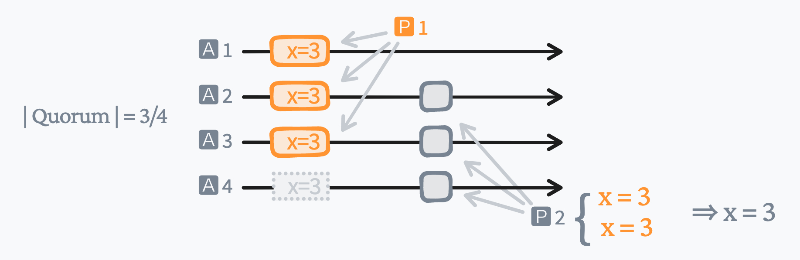
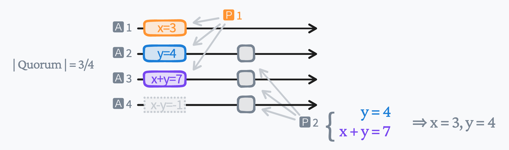
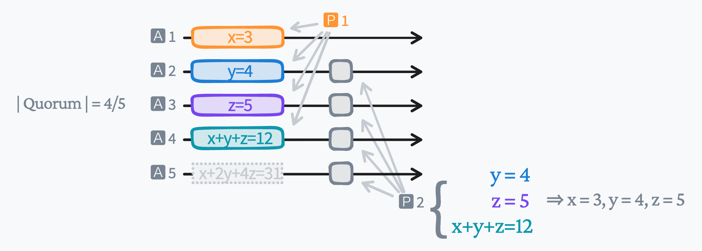

## Paxos: (Optimize): Asymmetric Acceptors

类似 [erasure-code](https://en.wikipedia.org/wiki/Erasure_code) 的算法也可以应用到paxos上以降低paxso的数据冗余.

### Paxos

在 [classic Paxos](http://lamport.azurewebsites.net/pubs/pubs.html#paxos-simple) 中, acceptors 是**对等**的 :

- 一个 proposer(quorum是: $q_i$) 将 $x$ 的值存储到 acceptor 上(至少2个 acceptor 上以完成对 $x$ 的提交).

- 当下一个 proposer(quorum是: $q_j$) 通过这几个 acceptor 来重建(也就是读) $x$ 的值的时候, 它必须访问到一个存储了 $x$ 的 acceptor.
  因此任意2个 quorum 的交集至少为1个 acceptor:

  $$
  |q_i \cap q_j| \ge 1
  $$

  即, 3节点集群中一个 quorum 是任意 2 个 acceptors:

  $$
  |q_i| \ge 2
  $$

在这样一个 3 节点 paxos 集群中:
- 数据冗余度是 300%;
- 容忍 1 个节点宕机;
- 可用性大约是 ${ 3 \choose 2  } p^2$, 其中 $p$ 是 acceptor 单位时间内的故障率.

### Asymmetric Paxos

因为我们可以从一个线性方程组 $ax+by=d_1, cx+dy=d_2$ 解得 $x, y$ 的值, 所以可以利用这个特性, 让 paxos 中的 acceptor 上存储不同的值(asymmetric), 来实现数据冗余的降低.

- 一个 proposer(quorum是: $q_i$) 将 $x, y, x+y, x-y$ 存储到 acceptor 1 到 4 上(至少成功3个, 以完成对 $x, y$ 的提交).

- 当下一个 proposer(quorum是: $q_j$) 通过这几个 acceptor 来重建(也就是读) $x, y$ 的值的时候, 它必须访问到**上面4个值其中的至少2个**.
  因此任意2个 quorum 的交集至少为2个 acceptor:

  $$
  |q_i \cap q_j| \ge 2
  $$

  即, 4节点集群中一个 quorum 是任意 3 个 acceptors:

  $$
  |q_i| \ge 3
  $$

在这样一个 4 节点非对称 paxos 集群中:
- 数据冗余度是 200%;
- 容忍 1 个节点宕机;
- 可用性大约是 ${ 4 \choose 2  } p^2$, 其中 p 是 acceptor 单位时间内的故障率.

### Asymmetric Paxos 5-4

一个5节点的非对称 paxos 集群中, 可以存储3个相互独立的值 $x, y, z$:

一个 proposer 将 $x, y, z, x+y+z, x+2y+4z$ 5个值存储到 acceptor 1 到 5 上.
为了重新读到这 3 个值, 必须保证: $|q_i \cap q_j| \ge 3$.
因此最小的 quorum 的大小为任意4个 acceptor: $|q_i| \ge 4$.

在这样一个 5 节点非对称 paxos 集群中:
- 数据冗余度是 140%;
- 容忍 1 个节点宕机;
- 可用性大约是 ${ 5 \choose 2  } p^2$.

### Summary

利用 [asymmetric paxos](https://github.com/drmingdrmer/consensus-essence/blob/main/src/list/asymmetric-paxos.md), 稍微降低数据的可靠性, 可以有效降低数据的冗余.

这个算法只能应用于 paxos, 因为 [raft](https://raft.github.io/) 的 leader 只从本地一个副本重建committed的数据, 而这个算法需要2个或更多节点的数据.

