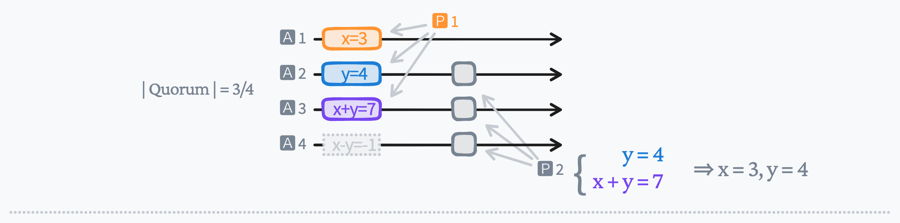
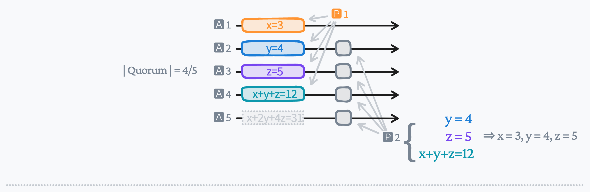
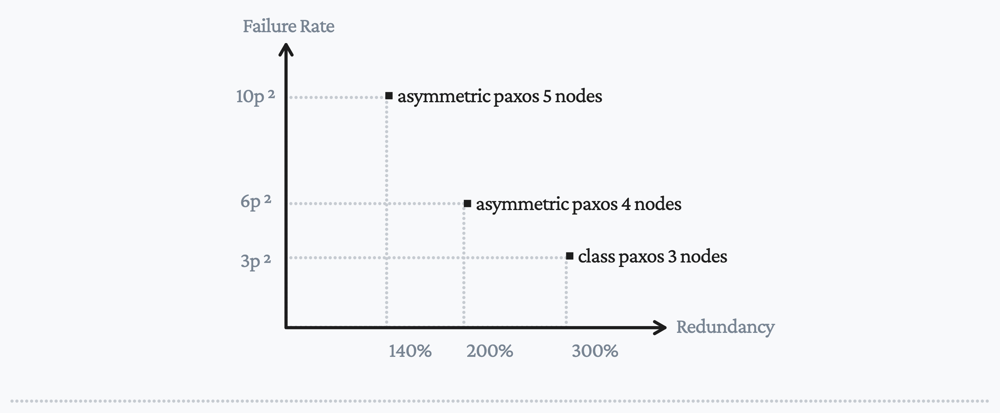

## Paxos: (Optimize): Asymmetric Acceptors

An [erasure-code](https://en.wikipedia.org/wiki/Erasure_code) like algorithm can be applied to the storage layer of
paxos to reduce data redundancy.

In [classic Paxos](http://lamport.azurewebsites.net/pubs/pubs.html#paxos-simple),
acceptors are **symmetric**:

A proposer(quorum: $q_i$) stores value $x$ on acceptors(at least 2 acceptors) to commit $x$.
To rebuild(read) $x$ from acceptors, another proposer(quorum: $q_j$) has to visit one of the acceptor that holds the committed value.
Thus two quorums must have at least 1 common acceptors: $|q_i \cap q_j| \ge 1$.
I.e., a quorum for a cluster of 3 is any 2 acceptors: $|q_i| \ge 2$.

Redundancy is **300%**; Tolerates **1** failure; Availability is about ${ 3 \choose 2  } p^2$, where $p$ is acceptor failure rate.

**Asymmetric Paxos**:
Because we can rebuild $x, y$ from a linear equation system $ax+by=d_1, cx+dy=d_2$,
acceptor states can be **asymmetric** so that more data can be stored:

A proposer(quorum: $q_i$) stores $x, y, x+y, x-y$ on acceptor 1 to 4(at least 3 of them) to commit $x, y$.
To rebuild(read) $x, y$ from acceptors, another proposer(quorum: $q_j$) has to visit at least two of the **4 values**.
Thus two quorums must have at least 2 common acceptors: $|q_i \cap q_j| \ge 2$.
A quorum for a cluster of 4 is any 3 acceptors: $|q_i| \ge 3$.

With such a policy: Redundancy is **200%**; Tolerates **1** failure; Availability is about ${ 4 \choose 2  } p^2$, where $p$ is acceptor failure rate.

Another example is **asymmetric Paxos 5-4**: 5 asymmetric acceptors can store 3 independent values
$x, y, z$:

A proposer stores $x, y, z, x+y+z, x+2y+4z$ on acceptor 1 to 5.
To rebuild these 3 values, this must hold: $|q_i \cap q_j| \ge 3$.
Thus quorum size is at least 4: $|q_i| \ge 4$.

Redundancy is **140%**; Tolerates **1** failure; Availability is about ${ 5 \choose 2  } p^2$.

**Summary**: with asymmetric paxos, the avaiability decreases slightly while the data redundancy is reduced in [asymmetric Paxos](https://github.com/drmingdrmer/consensus-essence/blob/main/src/list/asymmetric-paxos/asymmetric-paxos.md).
This algorithm applies to paxos and its variants but not to [raft](https://raft.github.io/).
Because it requires more than one nodes to rebuild a committed value.

