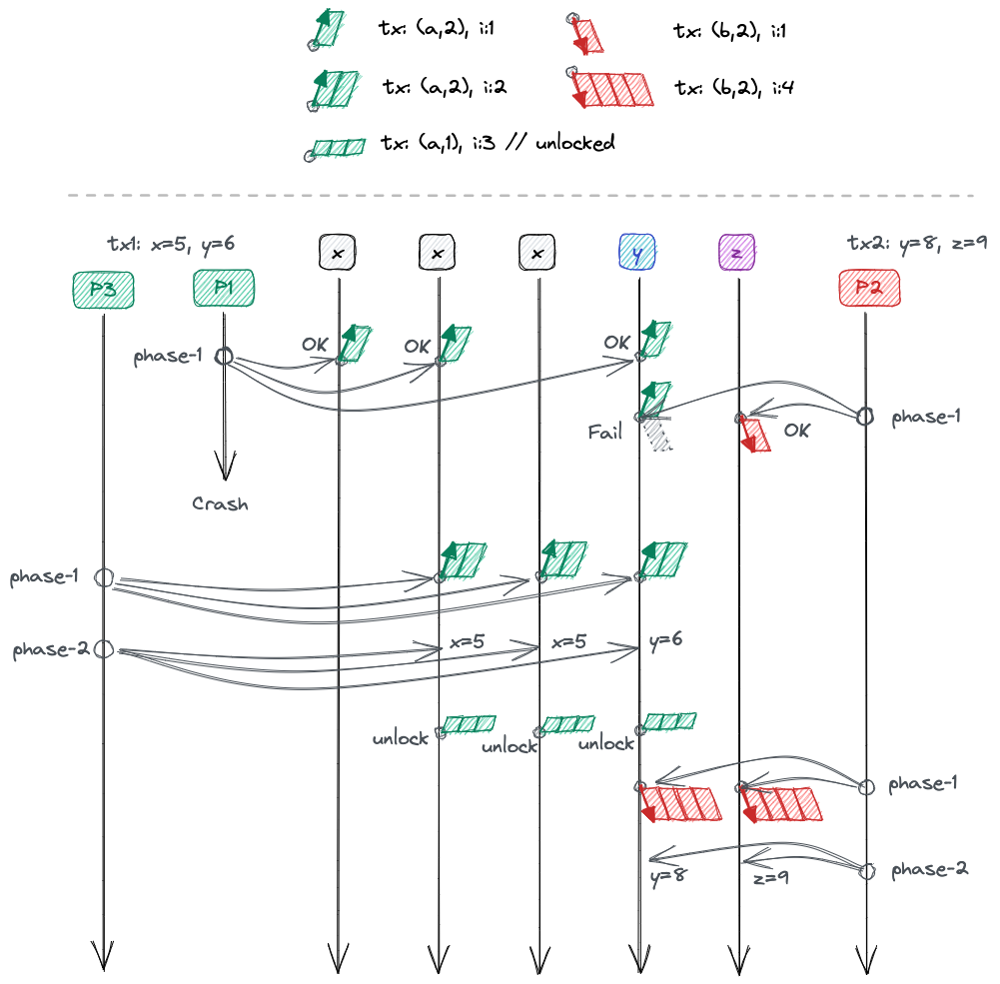

This is a backup of the unfinished part

# 实现 paxos+2pc

既然可以将 abstract-paxos 以不同的方式约束程 paxos 或 2pc,
如果放开这些限制, 它就可以同时提供paxos和2pc的功能. 类似spanner种的2pc over paxos 的架构, paxos 负责故障冗余, 2pc 负责事务性.

如果有 abstract-paxos, 可以以一个协议完成这两个功能.

## Time

time 定义为:
```rust
struct AbsTime {
    tx: (Txid, s), // s in [1,2]
    i: int,
}
```

这里tx表示事务相关的信息, 它表示在Txid的这个维度上有2个状态: locked(s=2),
和unlocked(s=1). i 仍然是一个递增id.

### time 大小关系

我们允许同一个事务中执行类似paxos的操作, 所以如果AbsTime.tx.Txid相同,
则直接比较i来确定 time 的大小关系.
如果AbsTime.tx.Txid不同, 则只允许另一个time的tx为unlocked状态才定义为大于等于.

```rust
fn greater_equal(a: AbsTime, b: AbsTime) {
    if a.tx.Txid == b.tx.Txid {
        a.i >= b.i
    } else {
        if b.tx.s == 1 { // unlocked
            a.i >= b.i
        } else {
            false
        }
    }
}
```

$$
r_b \ge r_a \iff |t_b| \ge |t_a \times t_b| \land i_b \ge i_a
$$


TODO: two vaule x and y may have different `v_time`


#### Acceptor

Acceptor 按照分组冗余, 例如: A1,A2,A3 存储变量x, A4,A5,A6 存储变量y
那么r(S) 的要求是包含每组至少一个Acceptor. quorum 是2组Acceptor的joint quorum


例如 P1 执行tx1,更新x=1 y=3, P2 执行tx2,要更新 x=2,y=4

这两个事务:

t1时刻, P2 在A5,A6上完成phase-1, P1 在A1,A2,A4上完成phase-1, 但在A5上因为有[tx2,2]所以phase-1失败.
当然P2这时也已经不能完成phase-1了.

这时P1决定放弃执行等P2完成, 于是在t2时刻, 使用P3将

- Acceptor 有5个: 存储x的3个副本, 存储y和z的各一个副本.

- P1 执行 tx1, set x = 5, y = 6
    对P1, R(S) 为 3个x副本的任意一个, y
    quorum 为 x副本中至少2个和y

- P2 执行 tx2, set y = 8, z = 9
    对P2, R(S) 为 y 和 z
    quorum 为 y 和 z

- P1 执行 phase-1 成功.

- P2 执行 phase-1 在y上由于冲突失败,  在z上成功.

- P1 crash
- P3 接替, 用更大的time={tx:(a, 2), i=2 } 在 x2 x3 和 y 上完成phase-1
- P3 完成phase-2 此时提交成功, 在phase-2阶段可以直接用更大的time完成解锁的工作.
- P2 提升time={tx:(b, 2), i=4} 完成新一轮的phase-1,
- P2 完成phase-2
- 2个事务先后完成




# 其他

这里事务可能提交一半, 例如上面的P3 只在y上完成了phase-2.
这时P2如果看到半提交的y的值, 它可以选择使用这个值
基础上继续完成自己的事务.

如果要求事务提交的原子, 例如对于tx-a, x和y的值最终必须都提交完成或都失败,
那么就要求phase-2时, S中的每个v都带有其他v要提交的信息, 这样
