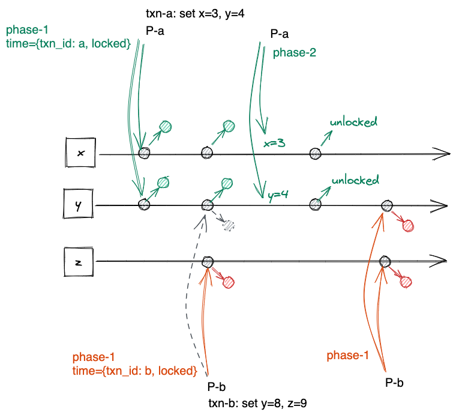

# 统一 paxos 和 2pc

classic paxos 和 2pc 有很多相似之处, 最多只能提交1个值, 且都有2个阶段.
实际上他们2个几乎是完全一样的算法, 可以看成abstract-paxos 的一个特例.
本文用一套协议重新实现分布式协议, 并用它实现paxos,
2pc和另一个融合的paxos和2pc的一致性协议, 解决2pc中coordinator失效问题,
用于替代分布式db中常见的2pc over paxos的设计.

P: Proposer<br/>
A: Acceptor<br/>
q: quorum: 一个acceptor的集合 ${A_i, A_j, ...}$<br/>
time: 对应 paxos 的 ballot number


n 个 Acceptor 共存储 n 个值 $v_1, v_2, ... v_n$, 他们可以不同. 也就是说Acceptor不是对称的.
所有 v 构成这个存储系统存储的状态 S,

$$
\vec{S} = [v_1, v_2, ... v_n]
$$


$R_j(S)$ 是一个 Acceptor($v_i$) 的子集,只需联系到一个 $R_i(S)$, 就可以用 $R_i(S)$ 来恢复 $\vec{S}$.

$R(S)$ 是所有 $R_i(S)$ 的集合:

$$
R(S) = \{R_1(S), R_2(S), ... \}
$$

## Quorum

Quorum 要求任意2个 quorum 的交集都可以用于恢复 S 的完整状态:
$q_i \cap q_j \in r(S)$

# 这些概念在具体一致性算法中的例子

### paxos 例子

例如 classic-paxos 中, 值是以副本的方式存储的, 例如三副本的 paxos 里 `S = [6,6,6]`; `R(S)` 是 Acceptor 集合的任意非空子集:
即只需联系到任一Acceptor就可以读出已写入的值:

```
R(S) in classic paxos(A, B, C are Acceptors):
{
  {A},   {B},   {C},
  {A,B}, {B,C}, {A,C},
  {A,B,C}
}
```

classic paxos 中, 要求任意2个 quorum 交集至少为1个 Acceptor.


### EC-paxos 例子

在之前提到的5节点 EC paxos 中, $x, y, z, x+y+z, x+2y+4z$ , R(S) 为至少包含3个 Acceptor 的集合:
 $\{x \in R(S) : |x| >=3 \}$,
例如, 其中一个 $R_j(S)$ 是 Acceptor 1,4,5, 即可以通过线性方程恢复整个系统的状态 S:

$$
\begin{cases}
x       & = v1 \\
x+y+z   & = v4 \\
x+2y+4z & = v5
\end{cases}
$$

根据R(S)的定义, 这里quorum 定义为任意4节点的集合,
使得任意2个quorum交集为3个节点.

### 2pc

2pc 中, R(S) 只有一个元素就是全体节点的集合: `R(S) = {{A1, A2...An}}`
因为假设每个节点上的数据都不一样且没有关联. 要恢复 S, 必须直接取得所有
Acceptor上的v.


2pc 中, 只有一个quorum, 就是全体节点, 因为2pc假设每个节点上的数据都不一样且没有关联.


# 实现

### 数据结构

```rust
// Time resembles ballot num or round number in paxos
// type Time: PartialOrd;

// The value an acceptor stores
// type V

struct Proposer<Time, V> {
    time: Time,
    quorum: HashSet<AcceptorId>,
}

struct Acceptor<Time, V> {
    time: Time,
    v_time: Time,
    v: V
}
```

## Protocol

### Phase-1

P:

```rust
struct Phase1Req {
    time: Time,
}
```

P 选择一个`time` 和一个quorum `q`, 将 `time` 发给 `q` 中的每个 Acceptor.

A:

如果`p1req.time > A.time`, 则更新: `A.time = time`
并返回处理请求前的 A 作为应答

```rust
fn handle_p1req(A: Acceptor, p1req: Phase1Req) -> Acceptor {
    let reply = A.clone()
    if p1req.time > A.time {
        A.time = p1req.time;
    }
    reply
}
```


### Choose value(proposer)

P 收到 `q` 中所有 Acceptor 的应答, 表示 phase-1 完成, P 开始选择一个要提交的值:

如果 `q` 返回的所有 `A` 都满足: `A.time <= P.time` 那么继续;
否则失败终止.

P 在收到的所有 A 中,
rebuild 出 S 中每个v, 对每个v选择A.v_time 最大的, S 中没有v由 Proposer
指定一个值.
执行phase-2

### Phase-2

P:

phase-2 中 P 将 S 中的每个 v 发给对应的 Acceptor:

```rust
struct Phase2Req {
    time: Time,
    v: S[i],
}
```

A:

如果 `p2req.time >= A.time`, 则接受这个值:

```rust
fn handle_p2req(A: Acceptor, p2req: Phase2Req) {
    A.time   = p2req.time
    A.v_time = p2req.time
    A.v      = p2req.v
}
```

然后返回 `bool` 值表示 Acceptor 是否接受了这个值.

```rust
struct Phase2Reply {
    ok: bool,
}
```


### commit

P: 如果收到 `q` 中所有 Acceptor 的 ok 应答, 则表示提交成功.

# abstract-paxos

可以看出 abstract-paxos 跟classic-paxos的算法几乎完全一样,
不同的仅仅是:

1) Acceptor 是非对称的,
2) time 可以是任意偏序值.

这2个小变化, 揭示了 paxos 和 2pc 之间仅有的差异, 引入这2个抽象, 就完成了paxos 和 2pc的统一.

在这个算法基础上做一些约束, 就可以分别得到 classic-paxos 或 2pc:

对 paxos 或 2pc, 他们的算法逻辑已经统一到一起, 不同之处就是为他们赋予不同的实现:

需要实现的部分包括:
- 这个系统存储的值的类型 V,  也就是Acceptor上的 vᵢ;
- 这个系统使用的虚拟时间类型 Time, 它决定了合法的事件发生的顺序;
- rebuild(): 读取操作(phase-1) 如何解释vᵢ并得到系统中已存储的值是什么;
- is_quorum(): 决定写操作(phase-2) 完成commit的标准;

```rust
trait AbstractPaxos<V> {
    type Time:    PartialOrd;

    fn rebuild(acceptors: Vec<Acceptor>) -> Vec<Option<V>>;
    fn is_quorum(acceptor_ids: &[NodeId]): bool;
}
```

## 实现 classic paxos

- 定义 time 为整数类型, 且每个 proposer 选的 time 不允许相同.
- S 中的 v 必须相同, 即 Acceptor 是对等的. 因此 r(S) 为任意非空的 Acceptor 的子集, quorum为 Acceptor 的 majority.

```rust
impl AbstractPaxos for ClassicPaxos {
    type Time = u64;
    fn rebuild(acceptor) -> Vec<Option<V>> {
        // find vᵢ with the max v_time
        let v = self.max_v_time_value();
        vec![v, v, v...]
    }
    fn is_quorum(acceptor_ids: &[NodeId]) -> bool {
        // majority
        acceptor_ids.len() > self.all_nodes.len()/2
    }
}
```


## 实现 2pc

- 定义 time: 提交事务id 为 tᵢ 的 proposer 的 time 为 `{locked: bool, txn_id: tᵢ}`;
  因为2pc定义中只有一个proposer,
  这个 time 的大小关系为:
  - 如果 a.txn_id == b.txn_id 则 `a >= b` 且 `b >= a`.
  - 否则b没有加锁时a才大于b(允许a抢走b的写权限).
  因此同一事务id的proposer可以随意加锁解锁,
  一个事务id(Proposer 的 time) 锁住某个节点会阻塞其他所有事务的运行.

- S 中的每个 v 代表一个事务中要操作的变量, r(S) 只有一个元素, 是包含所有 Acceptor 的集合, 系统中也只有一个 quorum, 也是所有 Acceptor 的全集.

```rust
struct TwoPCTime {
  locked: bool,
  txn_id: u64,
}
impl PartialOrd for TwoPCTime {
    fn ge(&self, b: &Rhs) -> bool {
      if self.txn_id == b.txn_id {
          true
      } else {
          !b.locked
      }
    }
}
impl AbstractPaxos for TwoPC {
    type Time = TwoPCTime;
    fn rebuild(acceptor: Vec<Option<Acceptors>>) -> Vec<Option<V>> {
        // find vᵢ with the max v_time
        acceptors.iter().map(|opt| opt.map(|a| a.v))
    }
    fn is_quorum(acceptor_ids: &[NodeId]) -> bool {
        acceptor_ids.len() == self.all_nodes.len()
    }
}
```



# 实现 paxos+2pc

既然可以将 abstract-paxos 以不同的方式约束程 paxos 或 2pc,
如果放开这些限制, 它就可以同时提供paxos和2pc的功能. 类似spanner种的2pc over paxos 的架构, paxos 负责故障冗余, 2pc 负责事务性.

如果有 abstract-paxos, 可以以一个协议完成这两个功能.

## Time

time 定义为:
```rust
struct AbsTime {
    tx: (Txid, s), // s in [1,2]
    i: int,
}
```

这里tx表示事务相关的信息, 它表示在Txid的这个维度上有2个状态: locked(s=2),
和unlocked(s=1). i 仍然是一个递增id.

### time 大小关系

我们允许同一个事务中执行类似paxos的操作, 所以如果AbsTime.tx.Txid相同,
则直接比较i来确定 time 的大小关系.
如果AbsTime.tx.Txid不同, 则只允许另一个time的tx为unlocked状态才定义为大于等于.

```rust
fn greater_equal(a: AbsTime, b: AbsTime) {
    if a.tx.Txid == b.tx.Txid {
        a.i >= b.i
    } else {
        if b.tx.s == 1 { // unlocked
            a.i >= b.i
        } else {
            false
        }
    }
}
```

$$
r_b \ge r_a \iff |t_b| \ge |t_a \times t_b| \land i_b \ge i_a
$$


TODO: two vaule x and y may have different `v_time`


#### Acceptor

Acceptor 按照分组冗余, 例如: A1,A2,A3 存储变量x, A4,A5,A6 存储变量y
那么r(S) 的要求是包含每组至少一个Acceptor. quorum 是2组Acceptor的joint quorum


例如 P1 执行tx1,更新x=1 y=3, P2 执行tx2,要更新 x=2,y=4

这两个事务:

t1时刻, P2 在A5,A6上完成phase-1, P1 在A1,A2,A4上完成phase-1, 但在A5上因为有[tx2,2]所以phase-1失败.
当然P2这时也已经不能完成phase-1了.

这时P1决定放弃执行等P2完成, 于是在t2时刻, 使用P3将

- Acceptor 有5个: 存储x的3个副本, 存储y和z的各一个副本.

- P1 执行 tx1, set x = 5, y = 6
    对P1, R(S) 为 3个x副本的任意一个, y
    quorum 为 x副本中至少2个和y

- P2 执行 tx2, set y = 8, z = 9
    对P2, R(S) 为 y 和 z
    quorum 为 y 和 z

- P1 执行 phase-1 成功.

- P2 执行 phase-1 在y上由于冲突失败,  在z上成功.

- P1 crash
- P3 接替, 用更大的time={tx:(a, 2), i=2 } 在 x2 x3 和 y 上完成phase-1
- P3 完成phase-2 此时提交成功, 在phase-2阶段可以直接用更大的time完成解锁的工作.
- P2 提升time={tx:(b, 2), i=4} 完成新一轮的phase-1,
- P2 完成phase-2
- 2个事务先后完成


# 其他

这里事务可能提交一半, 例如上面的P3 只在y上完成了phase-2.
这时P2如果看到半提交的y的值, 它可以选择使用这个值
基础上继续完成自己的事务.

如果要求事务提交的原子, 例如对于tx-a, x和y的值最终必须都提交完成或都失败,
那么就要求phase-2时, S中的每个v都带有其他v要提交的信息, 这样
