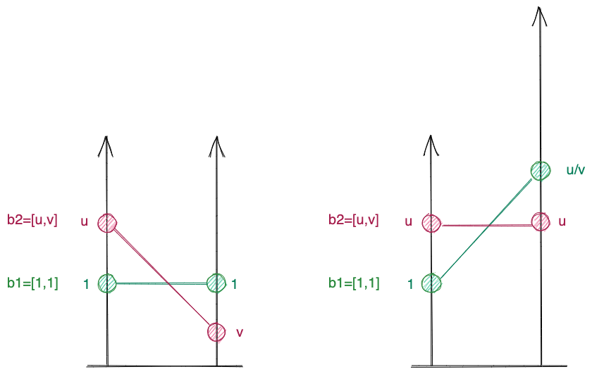

A paxos system,

- **2D**: Ballot is a vector of two scalar: $b = [u, v]$, 

The comparison function is defined as $f(b_1)$, f() defines the greatness.

There are a lot of `proposer` running in this system, thus a successfully
committed event(proposer with `b`) will see other events that are close to `b`.

Given two `b` so that $f(b_1) = f(b_2)$:
$b_1=[1, 1], b_2=[u, v]$

- **equivalent**: We assume that $b_1$ and $b_2$ are equivalent, i.e., $b_1$ ...

E.g, if we stretch the second scalar, b2 believes its `b` is `[1, 1]`,
then in its view, b1 becomes `1, u/v`.

Because of `equivalent`: $\frac{1}{v} = \frac{u}{1}$
∴ $uv = 1$

- **relative length** We assume that an event can not measure the length on every axis, but can only measure the relative length to its current `b`.

Thus for a given `b`, another `b'` has different value on these two axis: `u, v`.
This event interpret such difference in the following way:

- Let $t = \frac{1}{2}(u+\frac{1}{u})$, i.e., the average value of these two
    axis, 
- Let $l = \frac{1}{2}(u-\frac{1}{u})$, i.e., the difference of these two axis

In other words, `t + l = u` and `t - l =v`.

∴ $v = l/t = \frac{d-\frac{1}{d}}{d+\frac{1}{d}}$

∴ $u^2 = \frac{1+v}{1-v}$

∴ $t = \frac{1}{2} (\sqrt{\frac{1+v}{1-v}} + \sqrt{\frac{1-v}{1+v}}) =
\frac{1}{\sqrt{1-v^2}}$

∴ $t = \frac{1}{\sqrt{1-v^2}}$ is the [Lorentz transformation](https://en.wikipedia.org/wiki/Lorentz_transformation)
and:
- in this system the max value of `v` is 1
- every reference frame sees a slower clock in other reference frame.

b1 and b2 are two reference frames 

