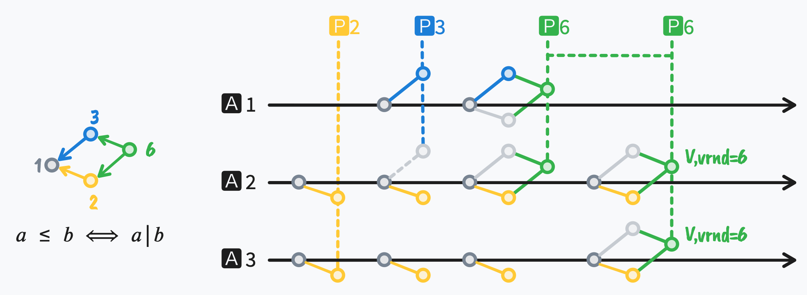

## Paxos: (Generalization): Partial Order Round Number = Paxos + 2PC

[Paxos](https://en.wikipedia.org/wiki/Paxos_(computer_science)) phase-1 requires a Proposer to produce an **integer** n to serve as `rnd`.
In fact, the definition of `rnd` can be generalized from an integer to any value of a [partially ordered set](https://en.wikipedia.org/wiki/Partially_ordered_set), and it can still satisfy the correctness of Paxos because the main use in Paxos is the property of the **size relationship** of `rnd`.

Using a partially ordered `rnd` in Paxos,
one can choose either **mandatory** conflict exclusion (similar to [2PC](https://en.wikipedia.org/wiki/Two-phase_commit_protocol))
or **non-mandatory** conflict exclusion (similar to Paxos's livelock) to implement the safety requirements of the consensus protocol.

For example, choosing the **divisibility** partial order relationship to implement Paxos, define `rnd` as a positive integer,
size relationship definition: **if a divides b, then a is less than b**:
in this case, we have: `1 < 2 < 6`, `1 < 3 < 6`, but `2 ≮ 3`.
In the following example, after Proposer P2 completes phase-1, P3 cannot complete phase-1 because on Acceptor A2, `3 ≯ 2`, thus abandoning P3, using P6 to complete phase-1, and then completing phase-2 to achieve a commit.

**In application**, the partial order `rnd` provides a very large extension space for consistency algorithms like Paxos,
it extends the one-dimensional sequence relationship to a multi-dimensional sequence relationship (similar to multi-dimensional time).

For instance, in a storage system, one could set up 2 groups of `rnd`:

- One group of Proposers only chooses 2ⁿ as `rnd`, intending to execute transaction A;
- Another group of Proposers only chooses 3ⁿ as `rnd`, intending to execute transaction B;

Thus, these two groups of Proposers are mutually exclusive, ensuring that at most one transaction is successful (avoiding the livelock in Paxos).
Meanwhile, multiple Proposers within a group can form a highly available backup (without the problem of the Coordinator crashing in 2PC).

Therefore, **partial order Paxos can provide the transaction exclusivity of 2PC, as well as the fault tolerance of Paxos, and can simplify the two-layer architecture of 2PC + Paxos in distributed DBs (such as Spanner) to a single layer**.
