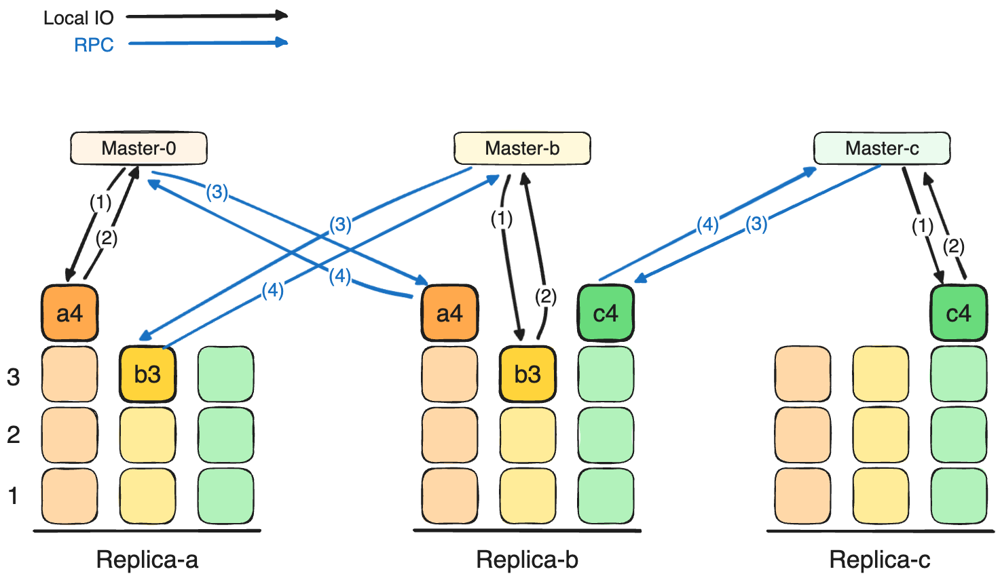
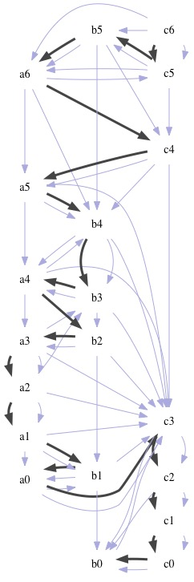
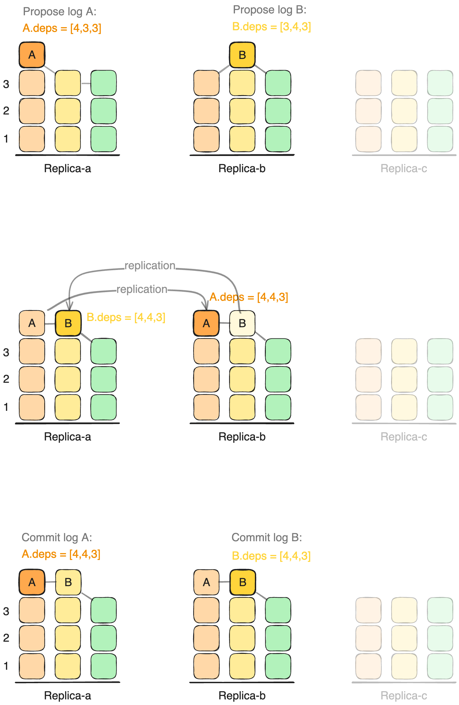
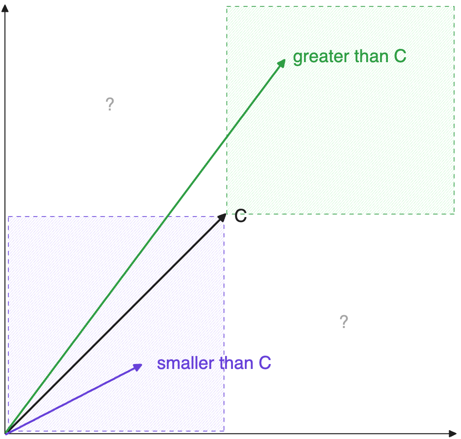
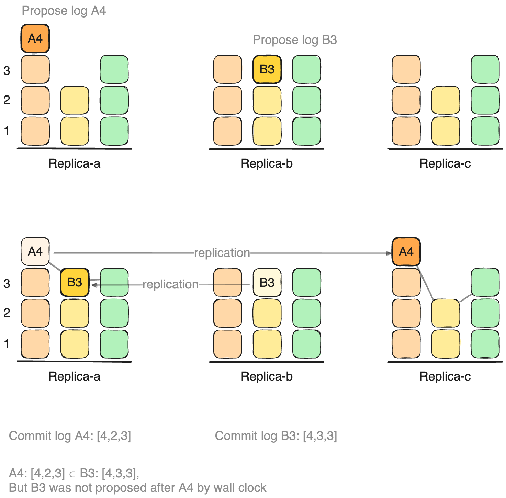

# Paxos, Multi Master, 狭义相对论


## 始于 Paxos

分布式一致性算法, 例如Paxos, raft是用于在分布式系统中对某些变量达成一致性的算法，Paxos算法被认为是分布式一致性算法领域的基石。有观点戏称，在世界上，有效的分布式一致性算法只有两种：一种是基于Paxos的算法，另一种是不正确的算法。
分布式一致性是一个一直在持续演进的研究分支, 我也写过几个由浅入深的这方面的文章:

- 在 [Paxos算法的直观解释][post-paxos] 中，我们对Paxos 进行了直观的介绍。Paxos使得在分布式系统中的多台机器上能够就某个值达成一致。因为Paxos只确定一个值, 仅仅是一个点, 可以把它看成是一个 **"0维"** 的一致性算法;

- 在 [Abstract-Paxos: 统一 Paxos 和 Raft][post-apaxos] 中, 我们介绍了 Raft, 因为我并不希望把网上泛滥的 Raft 协议字典一样介绍的文字再重复一遍, 于是本文中我选择了另一个角度, 通过把 Paxos 和 Raft 都抽象到一个算法中, 来展示如果从 paxos 推导出 raft, 从根本上向读者展示raft的原理: raft可以看成一个多值的一致性算法, 而这多个值又是整体的一个list, 从这个角度可以把raft看成一个在 **"一维"** 上无限增长的一致性算法.

- 而后在 [Multi Master Paxos 3][post-mmp3] 中, 我们介绍了一个多主模型的一致性算法, mmp3, mmp3 维护3个类似于raft的log column, 由3个master(类似于raft leader), 在严格一个RPC内无冲突的完成一条log的提交.
3个log column无冲突的写入新数据, 可以把mmp3 看做是一个 **"三维"** 的一致性算法.


今天我们继续在[Abstract-Paxos][post-apaxos] 基础上再进行抽象, 使之进化成一个允许任意多leader 的一致性算法, 
当然这里的 **"一致性"** 可能要调整一下了: 因为一致跟唯一已经不再是同一概念了.
当我们在多维度

可以认为 mmp3 建立了一个三维的空间, 回顾我们在 [Abstract-Paxos: 统一 Paxos 和 Raft][post-apaxos] 里介绍从0维的paxos到1维的 raft的演进, **一致** 本身就暗示着 **线性**,
在高维的空间中确定一个线性的顺序, 几乎必然的会产生狭义相对论的钟慢尺缩的效应. 


### mmp3: 三个Leader的无冲突提交

mmp3算法允许最多三个 master 在不冲突的情况下同时commit log。如下图, 每个副本都是1个master 完全并行的向自己负责的log column追加log, 并负责复制自己的log column到其他副本:



注意 mmp3 与其他多主算法不同: 像 [ePaxos][]或[Curp][] 只能在log无冲突的情况下实现一个RPC提交, 即后者要求日志之间在业务上不能有互斥操作(例如2条日志都修改变量x的值)，在存在冲突的情况下，这些算法通常会退化为需要两次RPC才能完成提交的算法。
mmp3 也不像另外一些多主一致算法, 后者内部仍有一个leader但不需要leader中转的算法, 例如 [TODO][].

mmp3 不需要考虑log是否有冲突, 且内部是完全对等的3个master执行写入.

就像很多multi master 协议一样, mmp3 的commit阶段并不进行最终日志的定序, commit阶段只是为后面真正的log定序提供log之间关系的数据, 并保证这些log之间关系的数据在多副本间保持一致. 
真正的log定序发生在 apply 阶段.

如下图, 3个log column中的log的依赖关系由灰色箭头表示, 这些都是在commit阶段确定的, 每个副本保持一致.
而在apply阶段, 每个副本则通过某种算法确定一个彼此间也一致apply 顺序(图中黑色箭头), 也就是把log 应用到state machine的顺序, 从而实现了分布式复制状态机要的目标.




### mmp3 通过log之间依赖关系的有向图定序

在 mmp3 的定序算法中，我们考虑了三个日志列之间的依赖关系。
每一条日志都有一个依赖向量 `[x, y, z]`，代表了在该日志提交（commit）时，它所 **"看到"** 的 3 个 log column 的日志的最大index（包括提交的log也包括没提交的log）。

这些日志项之间的相互 **"看到"** 的关系构建了一个有向图，该图的每个节点都是一个日志项，并且可能会包含环。
mmp3的apply算法的目标是找到一种算法，确保每个副本在遍历这个可能包含环的有向图时，都能确定出一个一致的遍历顺序。这个顺序决定了日志项的应用（apply）顺序，从而实现分布式系统中的一致状态机。

#### 环形依赖

有环的出现是因为在对2条log A 和 B 来说, A 在复制过程中看到了 B, B 也在复制过程中也看到了 A, 这表示AB之间在外界看来不是一个简单的顺序关系, 即不是 **"A 在 B 写完(commit)之后才开始写入"** 或反之.
在这种情况下 A, B 可以以任意顺序 apply 到状态机中(只要保持每个副本的 apply 顺序一致就可以), 或者说AB **不分先后**, 也可以认为A, B 的某种意义上的 **"同时"** 发生.

例如下图中, A和B同时被propose, 他们的依赖向量在复制前分别是 `A.deps = [4,3,3]`(4表示A也看到了自己), `B.deps = [3,3,4]`.
当AB分别复制到对方的副本时, A看到了未提交的B, 于是在副本2上A更新了自己的依赖向量为: `A.deps = [4,3,4]`, B则在副本0上更新: `B.deps = [4,3,4]`;
然后当replica-0 收到 A的replication应答后, 将`[4,3,4]`作为A的最终依赖向量commit, B同样也commit了依赖向量`B.deps=[4,3,4]`.
于是形成了环形依赖. 

在mmp3中, AB之间的环形依赖的出现 当且仅当 AB **"不分先后"** 的被propose, 即无法区分先后.




从依赖图中确定一个apply顺序有很多种方法, 例如 [ePaxos][] 中使用的是寻找最大强联通子图的方式, mmp3 中使用的则是统计依赖向量个数,
现在我们试图使用一种更通用的方式来确定apply 顺序,
即把某个log A的依赖向量(`A.deps`)看做一个vector clock: $\vec{C_a} = A.deps$, 通过vector clock的顺序来确定 apply shunx.

但是, 向量是不能直接比较的的, 
所以我们就需要为向量时钟找到一个顺序定义(order), 用这个order来来确定日志的apply顺序。


TODO 图?

## 向量时钟定序的基本要求

用 vector clock 的顺序确定apply的顺序, 那么这种顺序必须满足以下条件：

- C-consistency. **执行结果的一致性**：在每个节点上的执行结果必须是一致的。
- C-linear. **vector clock 要保证线性一致性**：即, 如果事务B 是在事务A 提交之后才提出（propose）的，那么B必须在A之后进行apply。

只有当满足上述两个条件时，我们才能说这是一个可用的apply定序算法。
现在让我们来探讨，符合这两个条件的vector clock的顺序是如何确定的.

虽然我们还没找到 $\vec{C}$ 之间的大小关系, 但是相等的关系是很直接的:
- O-1-eq: 只有vector clock的每个分量都相同时, 才认为这两个vector clock相等: $\vec{C_a} = \vec{C_b}$ 


### Vector clock 是全序关系

虽然我们还不知道vector clock的大小关系是怎样的, 但不难看出, vector clock的比较关系是一个全序关系 `≤`:

- 因为 C-consistency, 任意2个vector clock必须都有一个确定的大小关系, 否则无法在多个副本上以相同的顺序apply log;

- [自反性][]: `vc_x <= vc_x`; 自己跟自己相等;

- [反对称性][]: `vc_x <= vc_y && vc_y <= vc_x` 则 `vc_x == vc_y`;
    这一点也很明显, 因为如果2个不同的vector clock能构成这样一个环,
    就无法确定他们之间的先后顺序了. 所以我们寻找的比较关系必须满足 [反对称性][]

- [传递性][]: `vc_x <= vc_y <= vc_z` 则 `vc_x <= vc_z`,
    因为任意2个vector clock 都可以比较大小, 所以如果不满足传递性就会出现环.


### Vector clock 需保证线性一致性

C-linear 要求: 如果事务 A commit 后, 事务 B 才被 propose, 即要求 `A before B` 时必须有 $\vec{C_a} < \vec{C_b}$.


∵ mmp3 已经保证了commit的数据的一致(commit后不会改变, 且总是能读到, 这点就像paxos和raft提供的commit保证一样), 包括log的value(包括这条日志要做的事情)在多副本之间的一致, 也包括deps(这条日志的vector clock)在多副本之间的一致, 

∴ 对于事务 A 和事务 B: `A before B`, B一定能看到提交后的A的全部信息, 也能看到并包含 A 的deps: 即 对 $A.deps = [x_a, y_a, z_a], B.deps = [x_b, y_b, z_b]$,
有 `A.deps ⊆ B.deps`, 

因为 `A ∈ B.deps` 但是 `B ∉ A.deps`, 所以 `A.deps ⊂ B.deps`, 
即:

`A before B ⇒ A.deps ⊂ B.deps`. 


因此如果我们定义依赖集的包含关系为vector clock的大小关系, 即: 如果 $A.deps \subset B.deps \implies \vec{C_a} \lt \vec{C_b}$, 就得到一个满足C-linear要求的 vector clock 定义:
$A \: before \: B \implies \vec{C_a} \lt \vec{C_b}$


∴ 这个就是我们得出vector clock的第2个 order property:
-  O-2-le-by-components: 即全部分量都满足`<=`的关系则认为 vector clock `<=` 的关系: $x_a \le x_b \land y_a \le y_b \land z_a \le z_b \implies \vec{C_a} \le \vec{C_b}$.


可以看出按照这个 vector clock 这个顺序去apply 每条 log,
一定能满足后propose的一定在先commit的之后apply.


但是，在某另一些情况下，一个向量的一部分分量可能大于另一个向量的对应分量，同时它的其他分量却小于另一个向量的对应分量，这时两个向量是不可比较的。
在我们的vector clock比较关系中也需要明确这些比较关系.




> TL;DR
>
> `A.deps ⊂ B.deps ⇒ A before B` 不一定成立. 
> 
> 其中 `A before B` 是指这2个事务(log) 在wall clock上发生的顺序, 反映到 mmp3 里, 变成一个向量的关系 `A.deps ⊂ B.deps`, 
> 但是即使在 wall clock 上不满足 `A before B`, A B 之间也可以产生 `A.deps ⊂ B.deps` 的包含关系.
> 例如下图中, wall clock 中事件发生的顺序可以是`A before B`, 也可以是以下这样, 其中B先于A被Propose, 但最终commit时B.deps包含A.deps: 
> - `Propose B3`, 
> - `Propose A4`, 
> - `Replicate A4 to Replica-c`, 
> - `Replicate B3 to Replica-a`, 
> - `Commit A4`, 
> - `Commit B3`.
> 
> 
> 
>  `A before B` 这样的约束, 反映到mmp3 里, log之间的依赖关系无法
> 
>  所以在所有的事件序列中, $E\{A \: before \: B\} \subset E\{A.deps \subset B.deps\}$


### 其他性质

O-3-monotonic: $\vec{C}$ 在它任何一个分量方向上都是单调的.
因为 O-2-le-by-components, `[x,y,z] < [x,y+d,z]`.


#### 单位无关

另一个假设是, 每个 leader, 可能使用不同的单位, 且互相并不互相协商.

Leader A 可以看到自己的seq, 也可以看到B的seq, 但在数值上并不假设seq-A 和
seq-B表示同样的意义. 即 leader A给每条日志seq += 5, leader B给每条日志 seq += 2;
每个leader按照自己的方式管理自己的计数分量. 

一个 Leader的依赖向量从记录log index变成记录它提交时看到的每个log
column中最后一条 log 的 seq(即每个log column 中的最大seq). TODO image

在这个假设下, apply 算法仍然要为每个 log 决定一致的顺序, 即:
对一对交错的向量, 只通过向量的分量的相对值就可以决定大小.


#### 简化问题

为了简化问题, 我们现在只观察2个 leader之间的vector clock的关系,
即假设mmp3系统中只有2个leader在工作, log column中也只有2个(column-0 和
column-1)不停的有新数据写入, column-2 一直为空.

这样问题简化为:

对2个向量 `[x, y]` 和 `[u, v]`,
我们只知道x和u的数值含义相同, y和v的数值含义相同, 
但我不知道一个单位的x和一个单位的y是什么关系,
在这种情况下, 我 要根据它来确定先后顺序.


### uv=1

前面我们提到, 2个 leader之间不需要协商来,
仅仅自己按照自己的意愿来管理自己的计数器 seq,

所以vector clock的2个分量只有相对值是有意义的,
即对于`[x i, y j]` 和 `[u i, v j]`的比较, 
只有 `[u/x, v/y]` 是有意义的.

所以当apply 某个 log时, 它的vector clock 是`[x, y]`,
那么以它的视角观察, 其他的vector clock都是相对值 `[u, v]`
TODO image

TODO: O_continue: `[u, v]` 是连续且可导的,
可导是因为对很小的a, b不能无穷大,

```
  a            b
  |\          /|
  |            |
  +------------+
```

#### 找到与 `[1, 1]` 等值的 `[u', v]`

观察一个向量 `[u_0, v]`: `u_0 < 1, v > 1`, 且 `[u_0, v] < [1, 1]`
因为O-2-le-by-components, `[1, 1] < [1, v]`,
即 `[u_0, v] < [1, 1] < [1, v]`
那么, 因为O_continue `[u_0, v]`是连续的, 所以`u_0`和1 之间一定有一个点`u` 使得
`[1, 1] == [u, v]`.

对于任意`v`, 都能找到这样一个`u`, 使得 `[1, 1] == [u, v]`

<!--
   - 而我们要求所有的vector clock组成一个偏序集,
   - 所以在`[u, v]`看来, 
   -->

由于相对性, `[1, 1]` 与 `[u, v]`相等, 那么`[u, v]`也和`[u^2, v^2]`相等,
所以 `[1, 1] == [u^n, v^n]`,这里n是整数

TODO: image

用反证法也可以马上得到, `[1, 1] == [u^n/k, v^n/k]`, 这里n, k是整数, k!=0,
也就是说如果我找到一个u, v那么u, v的有理数次幂都相等.
显然对正实数k都满足: `[1, 1] == [u^k, v^k]`
由于有理数集的稠密性;

假设这些跟`[1, 1]` 相等的点都在一个方程 `f(x, y) = 0` 上, 
假设 `f(e^u, e^v) = 0`, 一个点`[u0, v0]` 在这个曲线上,
那么`[n*u0, n*v0]` 也在这个曲线上.
所以这个曲线是一条直线.
所以与`[1, 1]` 相等的点在方程 `v = u^{-k}` 上, `k > 0`.

这说明, 当leader A 在自己和leader的seq分别为 a, b时开始propose一些日志,
当这些日志提交时, seq-A变成a', 时, 认为它与leader B提交的另一条log b seq=a'^k
是同时发生的.


```
  a            a^k
  |\          /|
  |            |
  +------------+
```

增加一个假设,  leader A增加了一定比例的日志, 跟leader
B增加同样比例的日志认为是同时发生的.

因为假设每个 leader都是对称的无法区分的, 所以k=1

所以与 `[1, 1]` 相等的 `[u, v]` 满足 `uv=1`


TODO: 这部分加到那?
[u, v] 的大小关系在x方向和y方向上都是单调的!!!


TODO image


---
使用中文整理语言, 可以调整顺序, 让它变得更易于阅读, 其中的英文不要翻译:


---


### 虫子视角的时间, 空间, 速度

现在假设一个被 leader A 驱动的虫子,
站在自己的参考系里, 也就是认为 leader A 提交的日志是1, 1,
取观察其他Leader propose的log, 同时appy的日志都满足
uv = 1/2

```
    ^
    |
    |
    |
 √2 +
    |
    |
    |
    +--------+------------>
            √2
```

虫子观测到这一个事件 B 发生时, B 的 vector clock 是 `[u, v]`,
虫子怎么诠释这个事件呢? 这个vector clock
在自己的时间向量上的分量是这个事件的时间特征, ,
同时它跟自己时间分量完全正交的分量, 虫子认为不是时间,
而是另外一个跟时间不相关的东西, 虫子叫它空间, 或距离.
于是虫子在自己的某个事件发生时, 观察到的另外一个事件,
相对于虫子自己的时间方向的2个分量为:
```
t' = [u, v] dot (1/√2, 1/√2)
   = 1/2 (√2 u + 1/(√2 u))
l' = [u, v] dot (-1/√2, 1/√2)
   = 1/2 (-√2 u + 1/(√2 u))
```

### 时空和速度的关系


另M= √2 u,
虫子在自己的时间t=1时, 观察到这个事件B发生在时刻 t', 距离l',
虫子推测这个事件B的速度是l'/t':
```
     -M + 1/M
v = -----------
      M + 1/M
```
换算一下,

```
M = √((1-v)/(1+v))
```

M 带入t' 和 l':
t' = 1/√(1-v^2)
l' = v/√(1-v^2)

也就是说虫子看到一个以速度v远离自己的事件, 观测到它的时间会变慢, 变慢的比例是t'

### 光速

这里虫子也很容易发现, 另一个事件B的速度v只能是`(-1, 1)`之间.
```
     1-M^2          2M^2
v = -------- = 1 - ------
     1+M^2          1+M^2
```

1就是虫子宇宙的最大速度光速, 光速出现在Leader B以无限快的速度更新seq的值.

或者说虫子宇宙中的光子是它这个二维宇宙中的一维的物体

### 光子


## 总结

uv=1 定义了一条双曲线, 将它旋转45度就是 x^2-y^2=1的形式.
双曲线也是狭义相对论里相对时间和相对空间满足的点的轨迹.

TODO: 相对论公式


我们从multi leader的分布式一致性算法到狭义相对论,
本质上来说, 可以理解为, 要在2维时间中确定一个一维的时间线,
而又不知道2个维度的计数器有什么联系只能通过相对变化来度量,
并得出一致的结果, 那么就会呈现出狭义相对论类似的特征,

光速不变在物理学里可以看做相对论的原因,
这里光速不变是一个结果, 达成一致性的结果.


在mmp three里面我们用的方法是。如何去确定为一个最先被apply的节点，比如说找到一个三点钟最小的那一个。

其实他可以通直接通过比较三个向量的值去确定一个唯一的顺序，我们可以构造一个这样的算法，而不是通过在。分析的的确定的图上面去行走的方法。

- 全序的: 任意2个元素可以比较

这里我们必须要求确定大小顺序的方法是 [反对称的][]。
即 `A <= B && B <= A ⇒ A == B`,

而且要求无环图, 全序无环图一定是传递的.


#### 假设是单位无关的

即, 数值单位不影响比较关系.

所以A只知道B的相对大小


如果u, v和1, 1相等, 那么u², v²也和1, 1相等:

(uv)ⁿ = k; n 是整数

也容易证明 n是实数都成立

所以A B两个向量相等的条件是 uv = 1, 即同时发生, 或同时apply的event


#### apply 定序
假设apply时无法直接知道log的index, 但能通过某些可观测的日志信息来为apply定序,
例如A和B2个node都等间隔的incr 某个变量e的值, e的值总是存在,
就可以拿它作为参考确定apply顺序

A和B可能以不同的间隔更新e的值, 例如A每5条日志为e加1, B每3条日志为e+1;
但只要e在持续被更新, 就总能找确定一个apply的顺序


A paxos system,

- **2D**: Ballot is a vector of two scalar: $b = [u, v]$, 

The comparison function is defined as $f(b_1)$, f() defines the greatness.

There are a lot of `proposer` running in this system, thus a successfully
committed event(proposer with `b`) will see other events that are close to `b`.

Given two `b` so that $f(b_1) = f(b_2)$:
$b_1=[1, 1], b_2=[u, v]$

- **equivalent**: We assume that $b_1$ and $b_2$ are equivalent, i.e., $b_1$ ...

E.g, if we stretch the second scalar, b2 believes its `b` is `[1, 1]`,
then in its view, b1 becomes `1, u/v`.

Because of `equivalent`: $\frac{1}{v} = \frac{u}{1}$
∴ $uv = 1$

- **relative length** We assume that an event can not measure the length on every axis, but can only measure the relative length to its current `b`.

Thus for a given `b`, another `b'` has different value on these two axis: `u, v`.
This event interpret such difference in the following way:

- Let $t = \frac{1}{2}(u+\frac{1}{u})$, i.e., the average value of these two
    axis, 
- Let $l = \frac{1}{2}(u-\frac{1}{u})$, i.e., the difference of these two axis

In other words, `t + l = u` and `t - l =v`.

∴ $v = l/t = \frac{d-\frac{1}{d}}{d+\frac{1}{d}}$

∴ $u^2 = \frac{1+v}{1-v}$

∴ $t = \frac{1}{2} (\sqrt{\frac{1+v}{1-v}} + \sqrt{\frac{1-v}{1+v}}) =
\frac{1}{\sqrt{1-v^2}}$

∴ $t = \frac{1}{\sqrt{1-v^2}}$ is the [Lorentz transformation](https://en.wikipedia.org/wiki/Lorentz_transformation)
and:
- in this system the max value of `v` is 1
- every reference frame sees a slower clock in other reference frame.

b1 and b2 are two reference frames 


