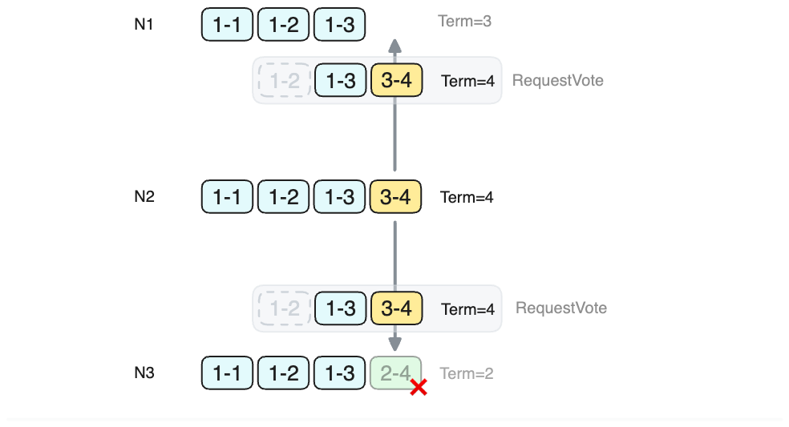

## Raft: (Optimize): Commit log via RequestVote RPC

This optimization allows a Candidate to complete the election and the initial
commit within a single round-trip time (RTT).
In standard Raft, the initial commit requires an additional RTT after the
Election phase to replicate a Noop log, resulting in a total of 2 RTTs.

The Election in standard Raft does not permit log replication:

> RequestVote RPC:
> ```
> Arguments:
>     term         : candidate’s term
>     candidateId  : candidate requesting vote
>     lastLogIndex : index of candidate’s last log entry (§5.4)
>     lastLogTerm  : term of candidate’s last log entry (§5.4)
> ```

We can optimize the protocol to allow Raft to replicate logs directly during the
Election by adding AppendEntries RPC fields to the RequestVote RPC:

```
prevLogIndex : index of log entry immediately preceding new ones
prevLogTerm  : term of prevLogIndex entry
entries[]    : log entries to store
```

For example, in the diagram below,
- N₁: Term=3, last log is (Term=1, index=3),
- N₂: Term=4, last log is (Term=3, index=4),
- N₃: Term=2, last log is (Term=2, index=4),

When N₂, as a Candidate at Term=4, initiates an election,
it sends to N₁ and N₃ with prevLogTerm=1, prevLogIndex=2, entries=[(Term=1,
index=3), (Term=3, index=4)];

At this point, N₁ accepts the logs, N₂ accepts the logs and deletes its own
local log: (Term=2, index=4), which certainly has not been committed.




**Protocol Changes**:

Upon receiving a RequestVote, the node Nᵢ executes the logic for AppendEntries
before dealing with Election logic:

If the term of the last log entry in RequestVote is not less than Nᵢ's term,
i.e., `RequestVote.entries.last().term >= Nᵢ.term`,

then do as AppendEntries does: append the logs to the local store (requiring
`prevLogIndex, prevLogTerm, entries`), and return a response with
`AppendEntriesOk = true`. Otherwise, return `AppendEntriesOk = false`.

**Candidate Changes**:

Corresponsively, if a Candidate receives `AppendEntriesOk = true` from a
majority, it should consider the log entries it has replicated to be committed:
`commit(RequestVote.entries.last().index)`.


### Proof-1

This optimization still ensures the correctness of Raft:

Suppose the term of the last log entry in RequestVote is `t₀`:
`RequestVote.entries.last().term == t₀`;

1, No committed log will be lost::

Given that `t₀ ≥ Nᵢ.term ≥ Nᵢ.entries.last().term`:

- If `t₀ > Nᵢ.entries.last().term`, then Nᵢ's local logs are definitely not
  committed (since Raft guarantees that only logs with the highest term can be
  committed).

  Therefore, overwriting uncommitted logs will not result in the loss of committed logs.

- If `t₀ == Nᵢ.entries.last().term`, then the local logs of Nᵢ and the logs in
  RequestVote must be **compatible**, meaning one is a substring of the other.

  Therefore, in this case, the AppendEntries operation will merge logs and will
  not cause the loss of committed logs.

2, The logs replicated by the Candidate are committed.

Since the Candidate received `AppendEntriesOk = true` from a majority,

It means that any other Candidate with a term greater than `t₀` will see
`RequestVote.entries`; hence, subsequent Leaders with larger terms will contain
these logs.

As a result, `RequestVote.entries` meet the conditions for being committed.


### Proof-2

It can also be considered that the Candidate takes over from the Leader of term
`t₀` to continue replicating logs (but does not propose new logs).

Therefore, following the same protocol, both replication and commitment will not
violate the correctness of Raft.
