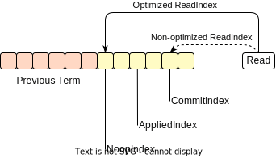

## Raft: (Optimize): ReadIndex: Less Latency through Relaxed Ordering

This approach is proposed by [neog24](https://github.com/neog24)

在 Raft 中，**ReadIndex** 机制用于实现 Linearizable 的读操作。本文通过放宽请求的先后顺序定义，来降低读请求处理延迟.

### 标准 Raft 实现的 ReadIndex 流程

1. **检查当前 Term 的日志是否已提交**：Leader 检查自己在当前 Term 内的日志是否已提交。如果未提交，则放弃读操作，等待日志提交后再处理。
2. **获取 ReadIndex**：Leader 将当前的 **CommitIndex**（已提交的最高日志索引）作为 ReadIndex。
3. **发送心跳确认 Leader 身份**：Leader 向 Quorum 发送 **heartbeat**，以确认自己仍然是集群的唯一 Leader。
4. **等待 StateMachine 应用日志**：等待 **AppliedIndex**（已应用到 StateMachine 的最高日志索引）达到或超过 ReadIndex，然后对 StateMachine 进行读取操作。

上述步骤保证了 Linearizable 特性：在读操作发生的时间点之前已经提交的所有数据，都能够在此次读操作中被读取到。

### 优化后的 ReadIndex 流程

- **设置 ReadIndex 为 NoopIndex**：当收到读请求时，将 ReadIndex 设置为当前 Leader 任期内的第一条 log 的 index，即 Leader 在成为 Leader 后立即写入的 **Noop** log 的 index（NoopIndex），而不是标准流程中的 CommitIndex。
- (发送 Heartbeat 的行为不变).
- **等待 AppliedIndex 达到 NoopIndex 后执行读取**：当 Leader 的 AppliedIndex 达到或超过 NoopIndex 时，立即对 StateMachine 进行读取操作，**而无需等待 AppliedIndex 达到 CommitIndex**。

通过这种优化，读操作仍然满足 Linearizable，即：

- 读请求能够读取到在其发生时间之前已经完成的所有写操作的结果。
- 读请求能够读取到在其发生时间之前已经处理的所有读请求所读取的状态。

### 放宽请求先后顺序的定义

在该优化中，我们放宽了标准 Raft 对请求先后顺序的严格定义：

- **标准 Raft 中的定义**：服务器先收到的请求和后收到的请求有明确的先后关系。后收到的请求应该看到之前收到的写请求所产生的状态，以及之前读请求所读取到的状态。
- **优化后的定义**：只有当一个请求已经向客户端返回了应答之后，再收到的新请求，才认为它们之间有明确的先后关系。如果第二个请求是在前一个请求处理完毕之前收到的，那么这两个请求在服务器端的处理顺序可以是任意的，都符合一致性要求。

### Linearizable 的保证

假设对于一个读请求 `r`, 在 `t` 时刻被 Raft server 收到:

#### 对于时间 `t` 之前发生的写请求 `w`

- **如果 `w` 是由当前 Leader 之前的其他 Leader propose 的**：当 AppliedIndex 达到 NoopIndex 后，StateMachine 已经包含了所有之前 Leader 提交的日志。因此，读请求 `r` 一定能够读取到写请求 `w` 的结果。
- **如果 `w` 是由当前 Leader propose 的**：
  - **如果 `w` 已经向客户端返回应答**：说明 `w` 已经被应用到 StateMachine。所以 `r` 必然能够从 StateMachine 中读取到 `w` 的结果。
  - **如果 `w` 尚未向客户端返回应答**：根据优化后的先后顺序定义，`w` 和 `r` 之间没有明确的先后关系。无论 `r` 是否读取到 `w` 的结果，都符合 Linearizable 的要求。

#### 对于时间 `t` 之前的读请求 `r0`

- **如果 `r0` 是在其他服务器上被处理的**：由于`r0` 只能看到已经提交的内容, 而当前 Leader 一定包含以前所有 Leader 所提交的内容, 所有以前 Leader 提交的内容都在 Noop log 之前，因此，读请求 `r` 读到的状态一定包含了 `r0` 看到的状态。
- **`r0` 在当前服务器上处理**：可以认为服务器按照顺序处理请求。由于 `r0` 在 `r` 之前处理，`r` 一定能够读取到至少与 `r0` 相同的状态。

我们可以看出，该优化在放宽请求先后顺序定义的情况下，仍然能够保证 Linearizable。这种优化减少了读操作的等待时间。
