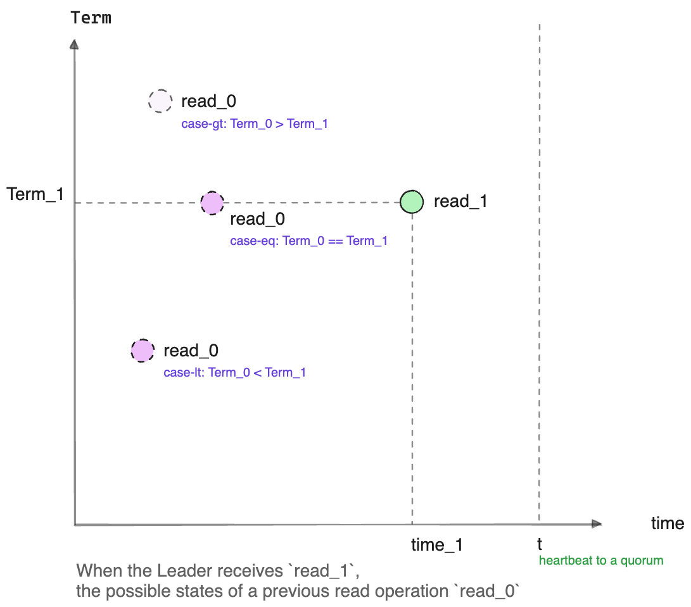

## Raft: (Optimize): ReadIndex: Less Wait

### 标准 Raft 实现的 ReadIndex 流程

在 Raft 中 ReadIndex 的标准处理步骤如下：

-   **步骤-1**. Leader 检查自己当前 Term 的 log 是否已提交. 如果没有, 放弃读, 返回, 等待当前 Term 的 log 提交.
-   **步骤-2**. Leader 取当前的 CommitIndex 作为 ReadIndex .
-   **步骤-3**. 向 quorum 发送 heartbeat , 确认自己是唯一的 Leader.
-   **步骤-4**. 等待 AppliedIndex 达到或超过 ReadIndex 再对 StateMachine 进行读取操作.

通过以上步骤这个流程保证了:
**一个 read 操作发生的时间(墙上时钟时间)之前已经被 read 的数据也一定能在这次 read 中被读到**, 也就是 Linearizable read.

例如 [etcd-raft][etcd-raft-read-index] 中实现的步骤.

我们来看看线性一致性读取是如何被保证的:

#### 线性一致性读的简单证明



当当前 node(Leader) 接收到一个 read 请求 `read_1` 时, 假设墙上时钟时间是 `time_1`, Leader 的 Term 是`Term_1`;

假设有另一个 read 请求 `read_0`, 发生在之前的某个时间, 即 `time_0`: `time_0 < time_1`,
那么读流程要能保证 `read_1` 一定能读到所有 `read_0` 读到的状态.

再假定 `read_0` 读的 StateMachine, 包含了直到 `(Term_0, index_0)` 所有 log 的状态,
也就是说 `(Term_0, index_0)` 这条 log 是 `read_0` 看到的最后一条 log.
那么其中的 `Term_0` 就有3种情况:

-   **case-gt**: `Term_0 > Term_1`:

    为避免这种不可处理的情况发生, Leader 在时间 `t` 向一个 quorum 发 heartbeat 请求, 以确认在时间范围 `(0, t)` 内都没有更高的 Term;

    而显然 `t` 在收到读请求 `read_1` 之后, 即 `t >= time_1`,

    从而保证了: 在收到读请求 `read_1` 的时刻 `time_1`, 没有其他读取者读到更大 Term 的 log(**步骤-3**).

-   **case-lt**: `Term_0 < Term_1`:

    对此, 因为 Raft 保证了当前 Leader 建立时, 一定含有所有已经 committed 的 log,
    所以 `index_0 < NoopIndex`, 这里 `NoopIndex` 是 Leader 建立时写入的 noop log 的 index;

    在这种情况下要保证 linearizable read, 就要求 `read_1` 读时的 StateMachine 至少要包含到 `NoopIndex` 的 log.

-   **case-eq**: `Term_0 == Term_1`:

    对这种情况, 读操作 `read_0` 一定是在当前 node 执行的读操作;

    我们又知道由于 Raft 协议规定只有已经 commit 的 log 才能被读取, 所以 `read_0` 读到的数据一定是当前 CommitIndex 之前的, 即 `index_0 <= CommitIndex`;

    所以, 要保证 linearizable read, 就要让 `read_1` 看到所有 `read_0` 看到的状态, 即要求 `read_1` 读时的 StateMachine 至少要包含到 CommitIndex 这个位置的 log.

根据以上分析, 就得到了标准 Raft 的 read 流程:

-   **case-gt** 被排除(**步骤-3**);

-   而当 **case-lt** 满足后, 也就是 `NoopIndex` 提交后(**步骤-1**), 就只需考虑 **case-eq** 了(**步骤-2**),

-   在 **case-eq** 中, 只需等 StateMachine apply 到至少 CommitIndex 再读(**步骤-4**), 就可以保证 `read_1` 一定看到 `read_0` 看到的 state, 实现 Linearizable read.


### ReadIndex 的优化

[Openraft][] 简化了这一流程, 具体如下：

1. Leader 取当前的 CommitIndex 和 Leader 的 noop log index 中较大者作为 ReadIndex.
2. 向一个 quorum 发送 heartbeat , 确认 leadership.
3. 等待 AppliedIndex 达到或超过 ReadIndex 再进行读取操作.

优化后的流程省略了初始的 Leader Term 检查的分支, 后2步则保持不变. 这个优化的的正确性也是显而易见的:

我们不知道 `read_0` 到底是 **case-eq** 和 **case-lt** 哪种情况, 所以他俩的约束都要被保证,
即要求 `AppliedIndex >= max(CommitIndex, NoopIndex)`.

### Openraft ReadIndex 的实现细节

Openraft 对于 linearizable read 简单的证明在这里: [Openraft linearizable read ][read] .

其中基于 Openraft 的 application 要做的只是调用 [`Raft::ensure_linearizable()`][ensure_linearizable],
这个函数返回时表明线性读的条件已经具备, 例如在 [kv-store][] 例子中实现的线性读:

```rust
async fn read (app: Data<App>, req: Json<String>) -> Result<impl Responder> {
    app.raft.ensure_linearizable().await;

    let state_machine = app.store.state_machine. read ().await;
    let value = state_machine.data.get(&req.key).cloned();
    Ok(value)
}
```

Openraft 内部对于 linearizable read 要做的事情封装在 `ensure_linearizable()` 中,
简化后的代码如下:

```rust
async fn ensure_linearizable(&mut self, tx: ClientReadTx<C>) {

    let read_log_id = {
        let leader_first = self.log_ids.by_last_leader().first();
        let committed = self.committed();

        std::cmp::max(leader_first, committed)
    };

    do_send_heartbeat_to_quorum().await;

    self.wait(None)
        .applied_index_at_least(read_log_id.index())
        .await;
}
```

### 优化带来的好处

这个优化除了减少潜在的 **有效的** 等待周期, 在逻辑上带来的另一个好处是, 减少了 **无效的** 等待的几率.

例如:
- 一个 read 请求到来时, Leader 还没 commit 自己 term 的 noop log, 这时 CommitIndex = c1, NoopIndex = n1, 显然 `c1 < n1`;

  - 在标准 Raft 中, 这时调用者被挂起等待;
  - 在 Openraft 中, 调用者开始等待直到 n1 apply 到 StateMachine.

- 然后假设又发生了选举, 当前 node 又成为了 Leader(当然是在一个更大的 Term 中), 假设 Leader 的 noop log 仍然没有 commit; 这时 CommitIndex = c2, NoopIndex = n2, `c2 < n2`;

在这个场景中, 我们可以看出标准 Raft 和 Openraft 之间的差别:
- 标准 Raft 中可能要重新等待一个更大 log index 被提交: `max(c2, n2)`; 这种情况会重复出现导致读请求 **有可能** 永远不会被执行
- 而 Openraft 不会产生这种 **活锁**, 只需要等待最初的 `max(c1, n1)` 被 apply;

这是一个不太可能造成问题的问题, 但在标准 Raft
中我们仍然需要花时间去考虑并证明它 **不会造成问题**,
Openraft 简化后的逻辑中, 完全避免了 **活锁** 的发生. 让验证正确性更容易.


[Openraft]: https://github.com/datafuselabs/openraft
[etcd-raft-read-index]: https://github.com/etcd-io/raft/blob/4fcf99f38c20868477e01f5f5c68ef1e4377a8b1/raft.go#L2063-L2098
[read]: https://github.com/datafuselabs/openraft/blob/79372b4dff4312f5eb344db76d5ed1dffe69fac7/openraft/src/docs/protocol/read.md
[kv-store]: https://github.com/datafuselabs/openraft/blob/79372b4dff4312f5eb344db76d5ed1dffe69fac7/examples/raft-kv-memstore/src/network/api.rs#L42
[ensure_linearizable]: https://github.com/datafuselabs/openraft/blob/79372b4dff4312f5eb344db76d5ed1dffe69fac7/openraft/src/raft/mod.rs#L398
