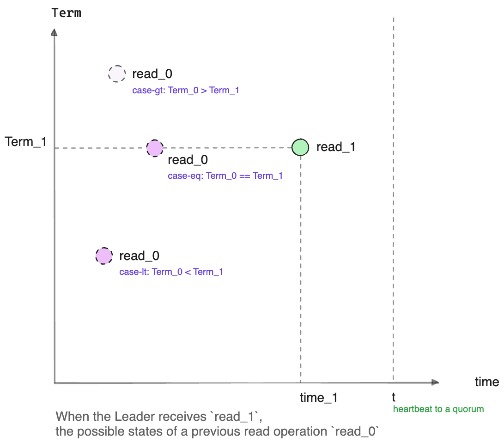

## Raft: (Optimize): ReadIndex: Less Wait

### ReadIndex Process in Raft

Raft's ReadIndex process ensures consistent reads across the cluster through these steps:

1. **Step-1: Initial Commit Check**: The leader checks if its latest term's entry is committed. If not, it defers the read.

2. **Step-2: Setting the ReadIndex**: Once a log is committed for the current term, the leader sets the ReadIndex to its current CommitIndex.

3. **Step-3: Leader Confirmation**: A heartbeat is sent to the quorum to ensure no other higher term exists at that moment.

4. **Step-4: Index Synchronization**: The leader waits for the StateMachine to apply entries up to the ReadIndex before reading, ensuring data consistency.

The steps in Raft's ReadIndex process are designed to ensure linearizable reads, guaranteeing that a read operation will reflect all preceding updates in the system's timeline.

Such an implementation is popular, e.g., in [etcd-raft][etcd-raft-read-index].

#### Proof of Linearizable Consistency



When a Leader node(at term `Term_1`) receives a read request labeled `read_1` at time `time_1`, it must ensure that `read_1` sees all data observed by any prior read `read_0` at `Term_0`, which took place at `time_0`.

Assume `read_0` saw the StateMachine's data up to log entry `(Term_0, index_0)`. We then consider three potential scenarios regarding `Term_0`:

- **case-gt: Higher Term** (`Term_0 > Term_1`): A heartbeat sent at time `t`(`t > time_1`) prevents the confusion of having a higher term exists in time range `(0, t)`(Step-3).

- **case-lt: Lower Term** (`Term_0 < Term_1`): Raft guarantees that the current Leader has all logs that are previously committed. Consequently, `index_0` must be lower than the no-op log index (`NoopIndex`) that is written upon the Leader's election. For consistency, the StateMachine must include logs up to at least this no-op entry(`NoopIndex`) when `read_1` is processed.

- **case-eq: Equal Term** (`Term_0 == Term_1`): In this case, the `read_0` is definitely conducted by the current node; Since Raft ensures only committed logs are visible to reads, `read_1` must be able to observe all data up to the current CommitIndex, which `read_0` would have seen.

By carefully managing these scenarios, the Raft protocol ensures that reads are linearizable:

- **case-gt: Higher Term** is preemptively resolved with the Leader's heartbeat confirmation (Step-3).
- **case-lt: Lower Term** is handled once the no-op log is committed (Step-1), leaving only the **case-eq: Equal Term** to be addressed(Step-2).
- For the **case-eq: Equal Term**, the Leader simply ensures the StateMachine has applied all entries up to the CommitIndex before processing the read (Step-4), guaranteeing that `read_1` observes all data seen by `read_0`.


### Optimization

In the **Step-1**, the leader does not have to defer the read. Instead, it
just sets ReadIndex to be `max(CommitIndex, NoopIndex)`. The **Step-3** and
**Step-4** does not change.

It is obviously correct because it simply combines requirements of **case-lt** and **case-eq**.

[Openraft][] implements this optimization: A brief proof can be found in: [Openraft linearizable read][read].

For Openraft application, it simply calls and blocks until [`Raft::ensure_linearizable()`][] returns, and the proceed reading process.
For example, [kv-store][] implemnts linearizable read with the following snippet:

```rust
async fn read (app: Data<App>, req: Json<String>) -> Result<impl Responder> {
    app.raft.ensure_linearizable().await;

    let state_machine = app.store.state_machine. read ().await;
    let value = state_machine.data.get(&req.key).cloned();
    Ok(value)
}
```

Internally, a simplified implementation of `ensure_linearizable()` would look
like the following:

```rust
async fn ensure_linearizable(&mut self, tx: ClientReadTx<C>) {

    let read_log_id = {
        let leader_first = self.log_ids.by_last_leader().first();
        let committed = self.committed();

        std::cmp::max(leader_first, committed)
    };

    do_send_heartbeat_to_quorum().await;

    self.wait(None)
        .applied_index_at_least(read_log_id.index())
        .await;
}
```

### Benefits of the Optimization

This optimization not only reduces the potential **effective** waiting period but also logically decreases the likelihood of **ineffective** waiting.

For example:
- When a read request arrives and the Leader has not yet committed its term's noop log, the CommitIndex is at `c1`, and the NoopIndex at `n1`, clearly `c1 < n1`;

  - Without this optimization, the caller would be suspended and wait;
  - With this optimization, the caller waits only until `n1` is applied to the StateMachine.

- Suppose there is a new election and the current node becomes the Leader again (naturally, in a greater Term), and assume the Leader’s noop log is still not committed; now the CommitIndex is at `c2`, and the NoopIndex at `n2`, `c2 < n2`.

In this scenario, we can see the difference between with and without this optimization:
- Without this optimization, there might be a need to wait again for a larger log index to be committed: `max(c2, n2)`;
- With it, it avoids this kind of **livelock** and only requires waiting for the original `max(c1, n1)` to be applied;

Therefore, in standard Raft, it is **possible** that a read request may never be executed, while in Openraft, this situation does not occur.

Of course, this is an unlikely issue, but in standard Raft, we still need to spend time considering and proving that it **will not cause a problem**. In contrast, Openraft's simplified logic completely avoids the occurrence of **livelocks**, making correctness verification easier.

The key to optimization is to simplify logic, not necessarily to reduce code (in terms of form). Simple logic sometimes requires more code to describe, and less code can also mean more complex underlying logic.

[Openraft]:  https://github.com/datafuselabs/openraft
[etcd-raft-read-index]:  https://github.com/etcd-io/raft/blob/4fcf99f38c20868477e01f5f5c68ef1e4377a8b1/raft.go#L2063-L2098
[kv-store]:  https://github.com/datafuselabs/openraft/blob/79372b4dff4312f5eb344db76d5ed1dffe69fac7/examples/raft-kv-memstore/src/network/api.rs#L42
[read]:  https://github.com/datafuselabs/openraft/blob/79372b4dff4312f5eb344db76d5ed1dffe69fac7/openraft/src/docs/protocol/read.md
