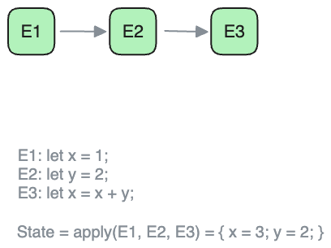
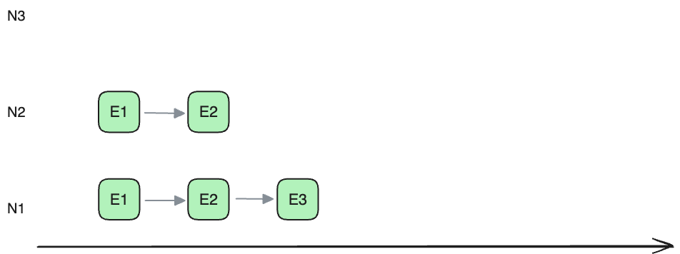
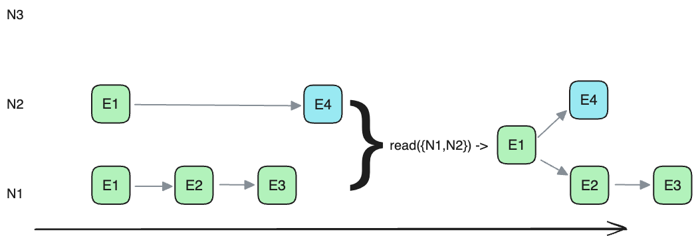
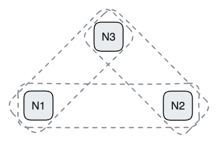
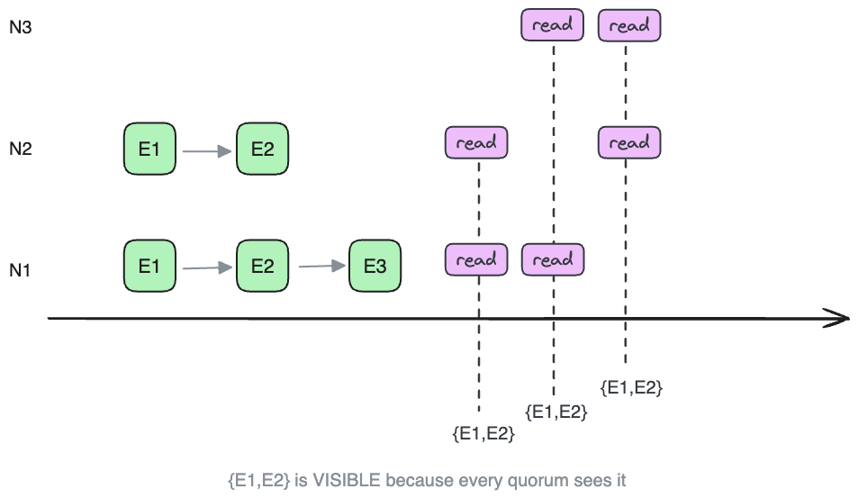
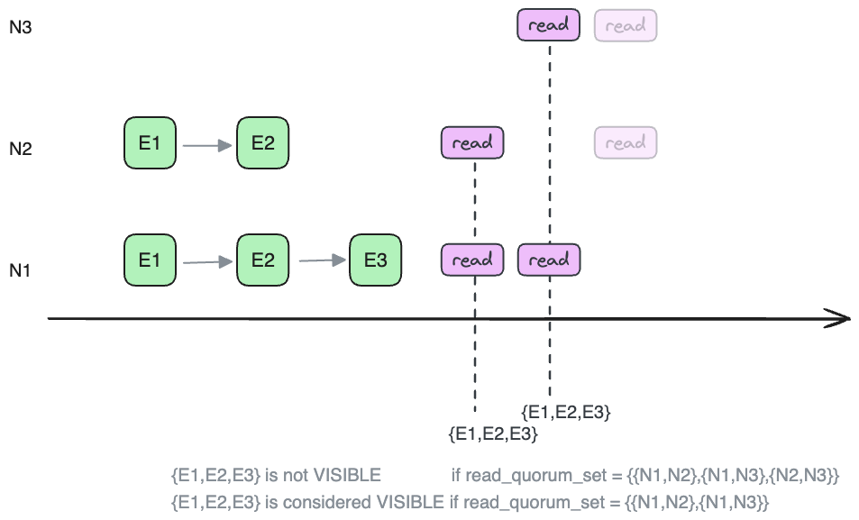
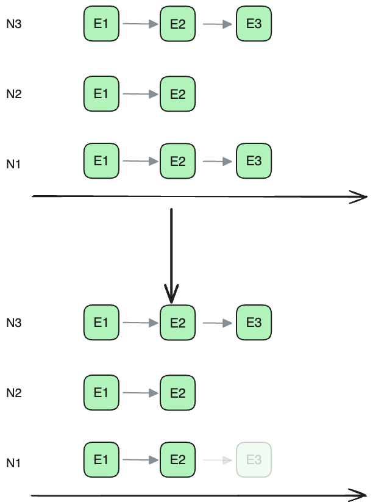
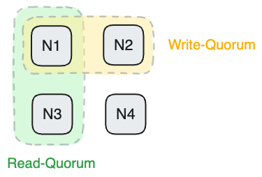
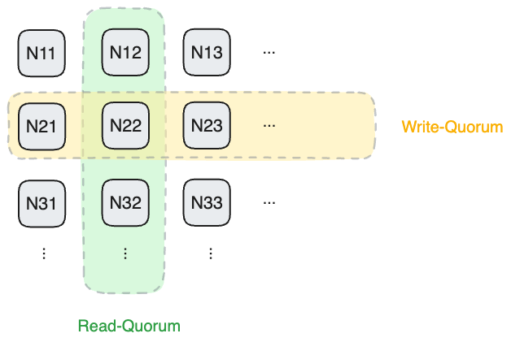
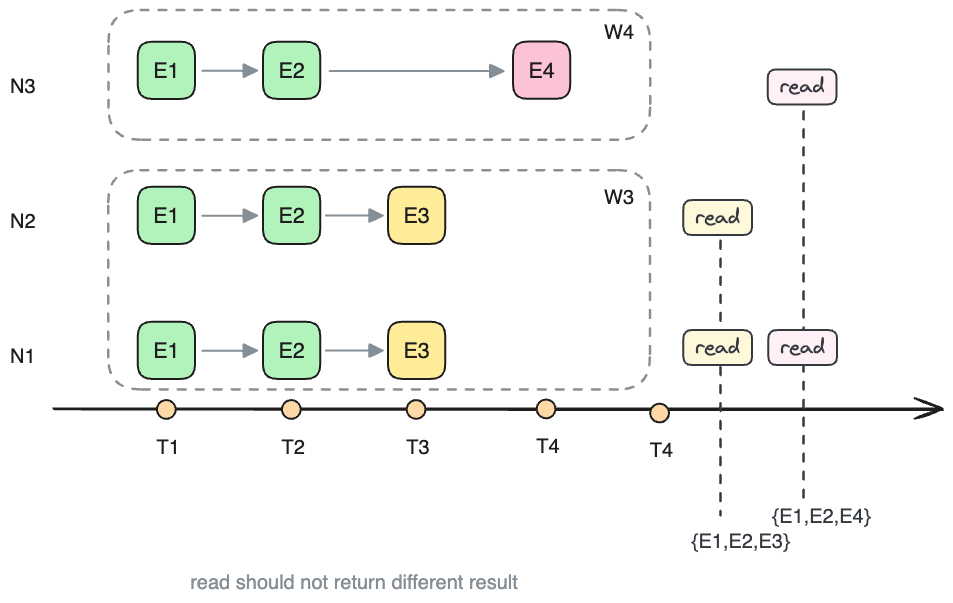

TODO: remove concept History quorum


# 历史; 时间; 时间定序.

一个分布式一致性协议, 可以看做是: 对一个系统的状态达成一致的协议,
而系统的状态(State), 可以等价的看做是一系列有序的, 对系统状态做出变更的**事件**(Event).
即任意一组有序事件唯一定义了一个系统的状态.
我们把这组**事件**称作系统事件的**历史**(Event History, 或History).

<!-- move to below -->
<!-- 要定义Event之间的顺序, 就需要给每个Event添加一个**有序**的标识(一般是全序的), 我们称这个标识为事件的**时间**(Time). -->

于是系统的State就可以用事件历史(DAG of events)来标识: 
```rust
State: DAG<Event>;
```

其中Event表示State的变化, 

<!-- , Time表示这些变化应用到State上的顺序. -->



这与我们单机系统的状态定义也是一致的, 例如3个Event分别是:
E1: let x = 1;
E2: let y = 2;
E3: let x = x + y;
那么系统的State就是 `State = apply(History) = apply(E1, E2, E3) = { x = 3; y = 2; }`

即一个系统的状态都可以用一组日志(History) 和 应用日志(History) 的一个方法
`apply` 来定义.

我们有了一个系统State的描述方式, 接下来在分布式环境中把它实现高可用,
即通过多个History的副本来实现高可用.

如果History的定义是一个简单的线性的Event 的log 数组, 那么`apply()` 也是一个简单的实现,
即逐个应用log.
如果History是一个非线性的结构, 例如是DAG关系组织的Event的图,
那么`apply()`就要包含更多的内容, 后面说

<!-- `apply()` 方法可以认为是确定的, 因此我们可以后面都用History来表示系统的状态(State) -->

<!--
   - # 分布式系统的接口定义
   - 
   - 对这个分布式系统, 需要有一个Commit(`commit(History)`)的定义和一个`read_committed() -> History` 的定义,
   - 也就是写和读的接口.
   -->


<!--
   - # 分布式的高可用
   - 
   - 高可用的定义是, 在这个 History 多副本的分布式系统的使用者:
   - - 同时,只需联系到其中几个副本, 就可以Commit一个新的History;
   - - 只需要联系到其中几个副本就可以读到已Commit的History.
   - 
   - 这里Commit是一个读写之间的契约,
   - 简单说一个History一定可以被读到那么就是Committed.
   - Committed的定义我们后面详细讨论.
   -->

我们先来看History部分.

一个在分布式系统, 可以看作每个节点上存储的History的副本的集合:

```rust
System: BTreeMap<NodeId, History>
```

## History Read Set

在这个分布式环境中, 读操作可以看做这样一个函数: `fn read(node_set: Vec<Node>) -> Vec<History>`:
它从多个节点`node_set`中读History副本, 并返回一个History的集合.

对读到的History中的任意一个, 我们可以称这个`node_set` 是这个`History`的一个 ReadSet. 表示这个`History` 可以通过这个`node_set`读到.

对系统的某个特定的状态, Histroy 的 ReadSet 定义为可以读到这个History的一个节点的集合.
注意这里要强调 **系统的某个特定状态**, 因为当系统状态发生变化,
例如新的数据写入更新等, 某个 node_set 可能就不再对读请求返回这个History了.


例如, 在下面,
- `read({N1})` 返回一个单元素的Vec: `[History{E1, E2, E3}]`, 
- `read({N1, N2})` 返回一个2元素的Vec: `[History{E1, E2, E3}, History{E1, #2}]`, 
- `read({N3})` 返回空 `[ø]`.

例如, 在下面这个3节点的系统中, `History{E1,E2,E3}`的ReadSet, 即能读到它的节点的集合, 有4个, 是所有包括N1节点的节点集合:

`{N1}, {N1,N2}, {N1,N2,N3}, {N1,N3}`

例如`read({N1})` 会返回`History{E1,E2,E3}`在结果里, 
`read({N1,N3})` 也会返回`History{E1,E2,E3}`在结果里.

但是`read({N3})` 不会返回`History{E1,E2,E3}`, 所以 `{N3}` 不是`History{E1,E2,E3}` 的一个 ReadSet

而`History{E1,E2}`的ReadSet有5个, 除了`{N3}` 之外的所有非空节点集合都是它的 ReadSet:
`{N1}, {N1,N2}, {N1,N2,N3}, {N1,N3}, {N2,N3}`,

例如`read({N2,N3})` 会返回`History{E1,E2}`在结果里.





对于返回的结果, 我们也可以将Vec<History>里的元素做一个并集来简化表示,
例如, 上图中, `read({N1, N2})` 可以看做返回了一个History: `History{E1, E2, E3}`

而在下图中, 我们可以认为`read({N1, N2})` 返回了一个树形的History:
```
 .->E4
E1->E2->E3
```




## Read Quorum Set

对每个系统, 不论是单机的还是分布式的,
都显式的或隐含的定义了合法的 `read()` 可用的 `node_set` 有哪些:

- 例如单机系统, `read()` 可用的 `node_set` 就是唯一这个节点`{{N1}}`,
    显然用一个空的 `node_set` 去读是没意义的.

- 一个简单3节点系统中, 如果不做任何限制,
    那么`read()`可用的`node_set`是所有非空节点集合: `{{N1}, {N2}, {N3}, {N1,N2}, {N2,N3}, {N1,N3}, {N1,N2,N3}}`
    但注意这样一个系统中`read()`得到的结果一般是没有任何高可用保证的.

- 一个多数派读写的3节点系统中(n=3, w=2, r=2), 
    `read()`可用的`node_set`是至少包含2节点的集合: `{{N1,N2}, {N2,N3}, {N1,N3}, {N1,N2,N3}}`,

如果一个read操作使用的 `node_set` 是这个系统定义的用于读的`node_set`,
那么认为这个read操作是合法的, 系统只给合法的读操作提供保证, 
对于不合法的read操作,
系统对读取的结果不能提供任何保证(undefined behavior).

**def-Read-Quorum-Set** **def-Read-Quorum**:
这个合法的用于`read()`的`node_set`的集合, 就是系统的`read_quorum_set`,
`read_quorum_set` 中的一个元素是一个节点集合, 称之为一个`read_quorum`.
`read_quorum` 是一个节点集合`node_set`, `read_quorum_set` 是一个 节点集合的集合.

例如 3节点的系统 的`read_quorum_set`是: `{{N1,N2}, {N2,N3}, {N1,N3}, {N1,N2,N3}}`,
因此 `read({N1})`, 系统就不对它返回的结果提供任何保证.




### Write Quorum Set

与`read_quorum_set` 对应的是 `write_quorum_set`:

**def-Write-Quorum-Set** **def-Write-Quorum**:

对一个节点集合(`node_set`)的集合 `{{Nᵢ, ...}, {Nⱼ, ...}, ...}`,
如果其中每个 `node_set` 都跟给定的`read_quorum_set`中的一个`read_quorum`有交集,
那么就称它是一个合法的`write_quorum_set`, 其中的每个元素是一个 `node_set`,
称为一个`write_quorum`.

一对 `read_quorum_set` 和 `write_quorum_set` 保证了: 每次写入都能被读到.


## 对系统总是可见的 History

对于处于某个状态的系统,
对一个 History, 如果它的 `read_set` 集合覆盖了 `read_quorum_set`,
即 `read_quorum_set ⊆ {read_setᵢ, ...}`
那么它就总是能被一次合法的读操作读到,
那么这个History就可以认为是在系统的某个状态时, 是 **总是可见** 的.

注意 **总是可见** 是跟系统的状态和 `read_quorum_set` 的定义相关的,
例如, 对 `History{E1, E2}`来说, 
如果 `read_quorum_set` 是多数派读写的定义, 即 `{{N1,N2},{N1,N3},{N2,N3}}`,
那么它 **总是可见** 的:



例如, 对 `History{E1, E2, E3}`来说, 
如果 `read_quorum_set` 仍然是多数派读写的定义, 即 `{{N1,N2},{N1,N3},{N2,N3}}`,
那么它不是 **总是可见** 的, 因为通过`{N2,N3}`读不到`History{E1,E2,E3}`,
淡入过修改 `read_quorum_set` 为 `{{N1,N2},{N1,N3}}`, 那么即使系统状态不变,
它也变成 **总是可见** 的了:




### Committed 的定义 和 数据丢失

直观上来说, 一个写操作达成Committed的状态就是说它总是能被读到了,
在单机上来说一个写操作只要完成就是Committed,


**def-Committed**:

对一个History, 从系统的某个状态开始, 在后续的所有系统状态中都是 **总是可见** 的,
那么就认为它是 Committed.

<!-- or -->

如果一个History从系统某个状态开始,
后面所有的系统状态(包括每个节点上History副本变化和read_quorum_set变化),
都能通过`read_quorum_set`读到, 那么这个History就是 Committed.


如果系统的变化没能保证一个History **总是可见**,
一般就是我们所说的数据丢失. 因为 **总是可见**
的定义是跟节点上存储的数据的状态和`read_quorum_set`决定的,
所以数据丢失一般常见的就是这两种:
例如, 一个3节点系统中, `read_quorum_set` 定义为
`{{N1,N2}, {N2,N3}, {N1,N3}}`,

- 节点上History副本状态回退, 例如磁盘损坏等; 

    这时如果 E3 从 N1 节点上删除了, 在这个系统状态的变化中, 就导致了`History{N1, N2, N3}`的丢失,
    因为 `read_quorum` `{N1, N2}` 无法读到 `History{N1, N2, N3}`.

    但是`History{N1, N2}` 没有发生数据丢失, 因为从任意一个`read_quorum`
    都可以读到它.

- 或者是系统的`read_quorum_set` 发生变化, 例如raft的单步成员变更算法的bug(已解决), 实际上就是read_quorum_set变化产生的. 下图中对应`read_quorum_set` 增加了`{N2}`  的情况.

TODO: 更新连接
https://blog.openacid.com/distributed/raft-bug/#raft-%E5%8D%95%E6%AD%A5%E5%8F%98%E6%9B%B4%E7%9A%84bug





## 系统可用性

可以看出, Committed 的是跟`read_quorum_set`相关的,
一般来说, `read_quorum_set`越大,
那么 Committed 达成的条件就越苛刻.


反之, 如果 `read_quorum_set` 越小, 系统提供的读的可用性就越高,
因为系统可以容忍更多节点宕机的组合(的概率)了;
然而`read_quorum_set`的缩小会要求对应的`write_quorum_set`的增大,
导致系统能对写提供的可用性降低.

例如不做限制的3节点系统(`read_quorum_set={{N1}, {N2}, {N3}, {N1,N2}, {N2,N3}, {N1,N3}, {N1,N2,N3}`),
要达成 Committed, 它的`read_quorum_set`是最大的, 就要求从任意节点都能读到这个History,
读操作不能容忍任何节点故障.

如果将`read_quorum_set` 去掉几个元素, 例如去掉`{N1}`,
即系统不再要求从`N1`节点上能读到这个History了, 系统就容忍了一定的故障(`N1`的故障),
也就是说可用性提高了.

高可用的定义(对读的定义)就是只需要一个系统的`read_quorum_set`有多小, 
或者说, 这个`read()`操作容忍了某些个`node_set`子集的的故障.


## 多重宇宙里的分布式一致性

如果允许History 是树状的或图样的(到目前为止我们都没有要求History是线性的),
那么以上就是分布式高可用一致性算法的实现:

向一个`write_quorum` 添加(不是替换)一个History 分支,
那么一定可以被一个`read_quorum` 读到, 那么这次写入就可以认为是Committed.

例如: 加图


因为History分支之间没有关联, 所以一个write操作可以读任意一个History,
加入新的Event构造一个新的History, 再将其写入到一个`write_quorum`, 即完成Commit.
当然新加入的Event可以依赖于已有的多个Event. 这样History会形成一个 Event的DAG.
否则History是一个树.
这里我们假设一个Event不会被多次加入到History里, 所以这个图是无环的.


可以看出, 我们现在没有引入时间的概念,
如果允许多重历史的存在, 那么就不存在时间的概念.

但是现在我们如果要求历史必须是线性的(即我们不能同时存在于多于一个历史时间线),
这也是我们常识认知中的现实.
那么就会引入时间的概念.


## 限制单一历史

但是我们现在希望得到一个线性History,
即至多只有一个无分支的History是Committed.

`read()` 现在返回一个DAG, 它是所有节点上读到的History的并集,
它可能有多个末端端点, `read()` 函数必须只能选择其中一个作为读到的History的结果.
而且对于一个Committed的History, 多个`read()` 总是选择它.
例如(加图) 分支A和分支B同时被读到, 那么就总是选择A
这说明每个History分支之间有一个二元关系, 也就是一个全序关系.
Committed的History分支, 必须是最大的.

表示这个全序关系, 就说明每个History分支都有一个全序关系的属性 T,
也就是说History上每个Event都对应一个全序关系的属性 T.

每次Commit一个Event, 它必须具有全局中最大的T.

或者说, 随着History中Event的增加,  T是单调递增的, 永远不会回退.

所以我们称之为这个分布式系统的**虚拟的** 时间.

所以说, 时间可以理解为将高纬度的空间映射到一维上的一个映射关系.


<!--
   - ## Read Quorum Set
   - 
   - 虽然对每个具体的History, 我们都知道它的quorum有哪些.
   - 但是对一个外部读函数`read`来说, 它不知道有哪些history,
   - 这时就需要系统约定一组用来给`read()` 函数用的节点集合的集合, 也就是这个系统用来读的quorum_set.
   - `read_quorum_set: {{N1,N2}, {N2,N3} ...}`.
   - 
   - 一般来说, 例如paxos或raft, 用**多数派**节点集合 作为系统的读quorum_set, 例如3节点系统中,
   - `read_quorum_set = {{N1,N2}, {N1,N3},{N2,N3}, {N1,N2,N3}}`. 注意这里节点全集`{N1,N2,N3}`是其他quorum的超集, 所以显然也可以作为一个quorum, 但后面一般不把其他quorum的超集写出来了.
   -->

## Commit 在线性History约束中的定义

这里Commit的定义也很直观, 对一个History, 如果
- 1 读操作可以通过系统中`read_quorum_set`中任意一个quorum读到它,
- 2 且总是能读到, 

它就是Committed.

第二个条件是显然要保证的, 否则认为数据丢失了.

例如下面的这个副本状态中:
- 如果定义系统的`read_quorum_set`是多数派,即`{{N1,N2}, {N1,N3},{N2,N3}}`, 那么`History{E1,E2}` 是Committed状态, 总是能被读到, `History{E1,E2,E3}` 不是,因为`read({N2,N3})` 不会返回它.


- 而如果更改系统的`read_quorum_set`定义, 改成`{{N1,N2}, {N1,N3}}`, 即要求所有读操作都必须读到N1节点,那么`History{E1,E2,E3}` 就可以认为是Committed状态.


<!--
   - # 读最大History
   - 
   - 显然现在的`read()` 操作返回多个结果, 但我们的分布式一致性协议要求只返回一个History, 
   - 所以`read2()`必须选择其中一个, 我们选择History最大的那个, 这里最大是指History中Time最大的那个Event的Time, 作为History的大小.
   - 在读到的多个History中,任何一个都可能是Commit的, 虽然最大的History可能是没有Commit, 但我们因为不能确定, 还是必须选择它.
   - 
   - 
   - 
   - 但是最大History不一定是Commit的, 我们还没有对写流程做任何约束,
   - 只需保证上面已经列出的条件, 其中和write有关的就是Commit的第二个条件, 
   - **一个读操作读到了一个History, 那么以后也应该一直能读到**.
   -->

# Write约束

## Write只追加History

这表示writer 写入时, 不能覆盖已有History, 只能追加.
即如果一个节点上的History是`{E1,E2}`, 那么不能被替换成`{E1,E3}`, 可以替换成`{E1,E2,E3}`.

<!--
   - ## Write quorum set
   - 
   - 另外, 根据上面对read的要求, Write的History达成Commit的条件是必须保证所有read-quorum都能读到它写的History.
   - 这就引出了`write_quorum_set`的定义: `write_quorum_set`中每个元素是一个节点的集合, 每个集合都跟`read_quorum_set`中的每个集合有交集.
   - 
   - 例如, 如果一个3节点集群的read_quorum_set 是多数派, 即`{{N1,N2}, {N1,N3}, {N2,N3}}`, 那么它的`write_quorum_set`就可以是多数派`{{N1,N2}, {N1,N3}, {N2,N3}}`,
   - 也就是常说的多数派读写quorum-rw的配置. 这里也可以看出quorum-rw只是分布式一致性的一个组成部分.
   - 
   - 
   - 
   - 又如, 一个4节点的集群的`read_quorum_set` 如果是`{{N1,N2}, {N3, N4}}`, 那么它的`write_quorum_set`就可以是`{{N1,N3}, {N2,N4}}`.
   - 
   - 
   - 
   - 
   - 如果一个n*n节点的集群的`read_quorum_set`定义是n*n矩阵中任意一行, 那么它的`write_quorum_set`定义就可以是任意一列.
   - 
   - 
   -->

## Write Prepare

虽然Write写到了`write_quorum_set`, 但是2因为read 会选择最大History, 所以可能产生一个问题, 因为有更大的History, 导致read忽略了写到`write_quorum_set`的History:

例如可能有2个Writer W3 和 W4, W3写了N1,N2, W4写了N3.
我们假设系统的`read_quorum_set`是多数派模式, 那么W3写的History{E1,E2,E3} 虽然能被任意一个read读到,
但是如果read操作选择了quorum {N2,N3}, 那么它会选择W4写入的更大的History{E1,E2,E4}, 
如果read操作选择了quorum {N1,N2}, 那么它会选择W3写入的更大的History{E1,E2,E3}, 
这违背了Commit的原则, 没有达到**总是能被读到**的要求.



## Write阻止更小的History被Commit

所以Writer把History写到节点上前, 必须要求没有更小的History被Commit.
所以假设Write要写的History的Time是T, 首先要发一个消息, 给一个`read_quorum`, 要求这个`read_quorum`里的节点都不接受小于T的write消息.
之所以是要写到一个`read_quorum`, 是因为系统中任意一个read_quorum跟任意一个write_quorum有交集, 但是write_quorum之间, 或read_quorum之间没有必须有交集的约束.
所以为了阻止其他write, 要写到一个read_quorum里.

## Write 要基于已经Commit的History追加

阻止了更小History的写入后, writer就可以选择一个在T时间的History来写入(即History的最后一个Event的Time是T), 
但是写入的History仍然不能破坏Commit的约束, 不能覆盖已经可能Commit的History.
所以writer还要联系一个`read_quorum`, 进行一次读操作, 
因为read操作保证读到Commit的History, 所以Writer在这个读到的History上追加新的Event再写入(paxos), 就不会造成已Commit的History丢失.
如果不满足这个条件, 就不能继续(raft).

这次读操作, 可以选择不同的`read_quorum`;
如果看到更大的History, 那表示无法写入, 要终止.

## 执行写入!

执行具体的write过程相对简单, 直接将整个History 复制到一个`write_quorum`, 完成Commit.


为了简化设计, 我们假设每个writer新增

TODO: 图:

所以, 最终我们得到的分布式一致性算法为:

每个Node存储的数据为: 一个线性的History路径, 和一个最小可Commit的时间
```rust
struct Node {
    least_commit_time: Time,
    history: BTreeMap<Time, Event>,
}
```

Phase-1

Phase-2


# Classic Paxos

将其简化成 Paxos 是非常直接的, 只需限制history不能包含多于1个Event;

# Raft

将其转变成 Raft 也很简单,
将Event设计成一个sub-event的容器,其中每个sub-event也分配一个时间`(T, index)`.
并要求在读Committed的阶段也考虑这个sub-Time.

剩下的就是将整块的History的复制实现为分段传输的协议就好了.

是不是很简单?


# 非线性一致性协议

以上我们将这个算法简化到了线性History,
实际上本文的目标是考虑非线性History会带来什么样的东西.

假如我们抛弃简陋的Paxos 和 Raft的限制, 允许Time是偏序的关系(或DAG关系这里?),
上面的协议会变成:

Phase-1 中, 仍然是小于 least 的Time不允许Commit,
Phase-1读中, 我们读到的最大History分支, 变成了读一个DAG History的 maximum(fix this term).
Phase-2 append Event 时, 它依赖于所有Time小于它的Event

现在我们可以证明这个算法允许同时Commit多个Event并行进行,
且也能满足正确性:

- Commit 后的值不会丢失, 总是能读到


# 选择二维向量Time

那么我们可以选择任何偏序的Time类型作为系统的时间.
我们现在选择二维向量, 即 `Time: (x i + y j)`.
其中i, j是2个维度, x, y表示Time在这两个维度上的值.
注意x和y可能是完全不同的类型,

## 二维之间的大小关系

`Time(xi+yj)` 中, 显然 `x₁ >= x₂ && y₁ >= y₂` 则 `T₁ >= T₂`, 
但`x₁ > x₂ && y₁ < y₂`的情况, 在没有其他条件下是不能比较大小的.

## 二维Time的工作流程

例如, 现在系统的状态是有一个E1,
E2 和 E3 的 Proposer 同时开始执行, 同时commit了E2和E3,
E4 只能看到E2, 也Commit了,
E5看到了所有, 最后Commit.


## 二维Time的应用

例如我们可以用这种方法对Raft进行一个扩展, 
i就是raft中的term, 保持不变.
j是墙上时钟的unix-timestamp,
然后将`Time: (x i + y j)` 替换Raft中的term, 来构建一个分布式系统.
这时我们会得到一个改进版的Raft: 在每个成员有时钟飘逸的情况下,
新的Leader也总是有更大的unix-timestamp,
这个分布式系统可以用来构建分布式授时服务, 优雅的解决Leader切换时的时间可能回退问题.

我举这个例子是为了说明, Time的每个维度之间的类型不能假设是一样的,
即不支持加法, 但可以支持乘法. 这将会引出后面的有趣的结论.


## Apply 阶段

分布式一致性算法的核心一个是log的提交(对应我们的Event History),
另一个是状态机的实现, 也就是将log(History) 以业务定义的方式进行解释.

我们上面提到, 系统的状态由History构成, 细心的你现在一定发现了一个问题,
就是对一个例如二维Time的History来说, apply 这些 Event的顺序是不确定的.


如果我们有量子计算机,
那么一个可行的实现是将所有符合DAG顺序的顺序来apply一次History,
这样所有的可能并存.

但是我们没有.


所以每个副本节点上, 我们仍然需要一个相互间一致的顺序来apply已commit的History.

而对于二维Time来说, 就是怎么为`x₁ > x₂ && y₁ < y₂` 关系的Time确定一个顺序.


假设找到2个T1, 和 T2是相等的关系, 

相对T1来说, T2是`x2/x1, y2/y1`


commit的定义: 总是能读到(因为: 可能脏读: 最大历史不在quorum里)
增加新历史前必须阻止其他写(阻止所有: 死锁, 2pc; 阻止旧的: raft, paxos)(为了满足commit)
自己不是最大历史不能写: 因为增加新历史前不能覆盖已有的(为了满足commit)
(一个简化的raft: 可以vote for非最大日志的candidate, 但是candidate自己不能继续写)
(paxos的不同做法是: 把最大历史拿过来)

raft 接append-entries时不需要用(t2, a) 覆盖 (t2,b)
