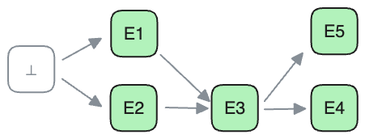
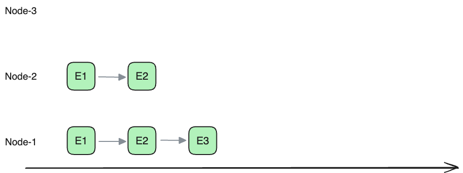
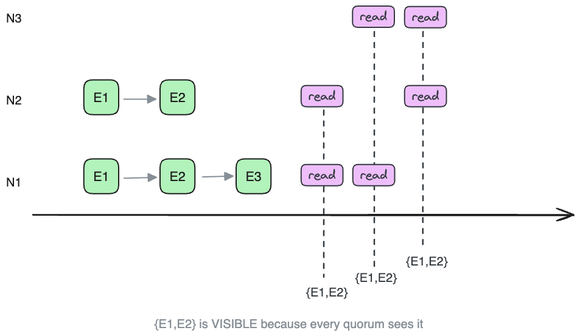
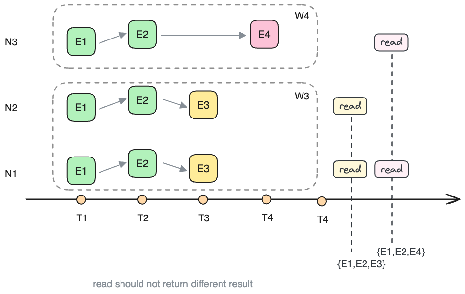

TODO: remove concept History quorum

# 历史; 时间; 时间定序.

一个分布式一致性协议, 可以看做是: 对一个系统的**状态**达成一致的协议,
而系统的状态(State), 可以等价的看做是一系列有序的, 对系统状态做出变更的**事件**(Event).
即任意一组有序事件唯一定义了一个系统的状态.
将一个Event加入系统时, 将与它有依赖关系的Event建立一条有向边. 这些边就表示Event加入的顺序.
我们把这组**事件**称作系统事件的**历史**(Event History, 或 History).

显然 History 是无环的.

于是系统的 State 就可以用事件历史(DAG of events)来标识:

```rust
type State = DAG<Event>;
```

其中 Event 表示 State 的变化,

<!-- , Time表示这些变化应用到State上的顺序. -->



这与我们单机系统的状态定义也是一致的, 例如 3 个 Event 分别是:
```text
E1: let x = 1;
E2: let y = 2;
E3: let x = x + y;
E4: let z = 5;
```
那么系统的 State 就是
```
State = apply(History)
      = apply((E1, E2)->E3->E4)
      = { x = 3; y = 2; z = 5}
```

即一个系统的状态都可以用一组日志(History) 和 应用日志(History) 的一个方法
`apply` 来定义, 显然我们要求`apply`方法是确定的: 多次执行得到同样的结果.

# 广义时间

**def-PTime**

抛开Event的内容, 图上一个vertex表示一个**时间**, 所有小于这个**时间**的Event, 即有一条路径到达这个vertex的Event, 是这个**时间**的History.
**时间** 决定了Event之间的先后顺序, 虽然这个顺序是偏序的.
但这里的时间并不同于我们常识中的时间, 所以我们另起一个称呼叫它 **广义时间**: PTime, PTime 是离散的, 由一个DAG表示的图.

如果把表示**传递性**的边从DAG图中去掉, 得到 Hasse diagram, (transitive-reduction DAGs),
那么Hasse diagram和一个偏序集是一一对应的,
所以:

 **广义时间** 是一个偏序关系的值. 每个时间点(DAG中的vertex)可以存在一个Event.
 
 (常识中的时间是线性的全序关系的值)


系统中所有发生的读/写都发生在一个指定的**PTime**上, 例如上图中,
- 在E3的时间上读, 就得到History `(E1,E2)->E3`;
- 在E4的时间上读, 就得到History `(E1,E2)->E3->E4`;


## History

History 定义为一个通过偏序关系的时间 PTime 关联起来的事件 Event 集合.

一个History 是一个DAG, 所以它一定有一个或多个 Maximal, 也就是最后的时间.
类似我们现实世界的线性时间的概念里, 一个History一定是一个单链, 只有一个Maximal, 就是当前时间.

在使用PTime的History中,可能有多个**最后时间**, 他们彼此之间是不可比较的.
例如:

特别的, 如果一个History中只有一个Maximal, 即最大时间, 那么把它写作 `History({ptime})` 的形式.
表示它的最大时间只有一个.


这里我们看到, 我们为了后面讨论更加方便, 现在必须把时间的概念从常识上的wall clock替换掉.
因为常识中的wall clock提供了一些既定假设, 会阻碍看到问题的本质, 例如我们已经假定了时间只能是正向流逝的, 可以用一个正实数表示的等.


## 用广义时间表示单线程环境

在我们常识中的单机系统, 可以用一个链表形式的历史来描述:
例如, 一个简单的程序:
```rust
let x = 1;
let y = 2;
let x = x + y;
```

可以表示为下面的历史演进

在这个系统的第二个状态(E1,E2)时,
历史的合理演进可以是:
-  我们可以在之后的时间(wall clock)继续改变系统的状态, 增加`E3`;

不允许发生的演进包括: 
- 不能回到过去在E1和E2之间插入一个`Ex`;
- 也不能让曾经存在过的E1消失


或者说, 时间只能变大. 即, DAG 上只能添加目标节点, 新加节点不能是源节点.

## 用广义时间表示一般状态

TODO

# 读写

这个系统上的读写定义为在一个指定时间上发生的行为:
```rust
fn read(ptime: PTime) -> History;
fn write(h: History({ptime}));
```


例如, 在单机系统中的读操作因为使用wall clock, 所以 ptime就是当前时刻不需要指定. 所以是`fn read() -> History`.
但一般我们只取其中一个key,所以是`fn read(key: &str) -> V`的形式.

而单机系统中的写也无需指定wall clock, 但我们一般不是把系统的整个状态写进去, 而是用一个command来表示
这个command描述在系统现有基础上做出哪些修改, 例如command是`let x = 3` 或 `let x = x + y`,
这些command的默认前提都是**在系统现有的状态下**做一个更新, 也就是在当前的wall clock时刻之前的已有状态基础上更新,
也就对应了我们最原始的`fn write(h:History({ptime}))`的逻辑.

这2个读写接口很容易映射到一个单线程的系统上, 我们希望也用这个接口去定义一个分布式的系统.

## 过去 未来 Committed

这里我们要提出一个概念:

如果对一个时刻 `ptime`, `read(ptime: PTime)` 的所有调用都返回同样的History, 
那么这个`ptime`时刻是 **过去**, 同时认为这个History是committed,
否则这个时刻是 **未来**, 这个时刻没有一个committed 的 History.

### 过去未来在单线程环境中的例子

在单线程环境中因为我们使用wall clock, 它随时都在流逝, 而且单线程环境中任意2次read操作都是有先后的.
所以每次读都是唯一的, 唯一所以本身就满足**不变**的条件, 所以每次读看到的都是**过去**,
无法看到**未来**.

但是在分布式中, 因为使用虚拟的时间, 在同一个时刻可以发生多次read, 可能得到不同结果.

### 过去未来在分布式中的例子

classic Paxos 中 的phase-1可以认为是一个read函数的调用,
而classic Paxos中的 PTime是它的ballot number(一般是递增变量和节点id组成的一个tuple),
所以, 如果一个paxos instance没有commit一个值(即还没有将一个值写到多数派), 
那么运行 classic Paxos的phase-1,可能会看到不同的值, 即现在系统存储着什么值,属于未来的,还没到来的一个状态.
而当一个值提交了, 那么后续所有的phase-1(后续指用更大的ballot number(对应我们的PTime)), 都能读到这个已提交的值.
即这个系统的值已经属于**过去**了,不会再变了.

所以也可以说一个时刻的状态是否不变, 表示了过去和未来.

假设一个三节点的classic paxos系统, 
发生的事件序列是: 

P1 用ballot number=1 通过node-1 和node-2完成phase1, 将值x写到node-1;
P3 用ballot number=3 通过node-3 和node-2完成phase1, 将值z写到node-3;

这时 P4(ballot number=4)执行phase-1, 如果
- P4联系node-1和node-2, 它读到的值是x
- P4联系node-3和node-2, 它读到的值是z.

读到不同的值表示系统的状态还没确定, 属于未来.

这时假设P4联系node-1和node-2完成phase1, 再将读到的值x写回node-1和node-2,
这时node-1和node-2的状态都是ballot number=4,vballot =4, value =x.

而后续的P5(ballot number=5), 不论通过哪2个节点完成phase-1,都会看到x(因为x的vballot比z的vballot大,z会被忽略),
这时认为系统的状态已经确定了, 属于**过去**了.


这也是我们对**过去/未来**定义的在分布式系统中最直接的一个反应.


# 分布式多副本的History

我们有了一个系统 State 的描述方式 History, 接下来在分布式环境中把它实现高可用,
即通过多个 History 的副本来实现高可用.

## 定义:

- 分布式表示, 系统中有多个History的副本, 存储在多个副本上;
- 高可用表示, 读或写不需要联系全部节点才能成功执行;

分布式给这个系统带来的改变是:

- 对多个副本的更新是各自独立的, 即一个节点达到某个状态后, 另一个节点可能是任意状态.

如果 History 的定义是一个简单的线性的 Event 的 log 数组, 那么`apply()` 也是一个简单的实现,
即逐个应用 log.
如果 History 是一个非线性的结构, 例如是 DAG 关系组织的 Event 的图,
那么`apply()`就要包含更多的内容, 后面说

<!-- `apply()` 方法可以认为是确定的, 因此我们可以后面都用History来表示系统的状态(State) -->

<!--
   - # 分布式系统的接口定义
   -
   - 对这个分布式系统, 需要有一个Commit(`commit(History)`)的定义和一个`read_committed() -> History` 的定义,
   - 也就是写和读的接口.
   -->

<!--
   - # 分布式的高可用
   -
   - 高可用的定义是, 在这个 History 多副本的分布式系统的使用者:
   - - 同时,只需联系到其中几个副本, 就可以Commit一个新的History;
   - - 只需要联系到其中几个副本就可以读到已Commit的History.
   -
   - 这里Commit是一个读写之间的契约,
   - 简单说一个History一定可以被读到那么就是Committed.
   - Committed的定义我们后面详细讨论.
   -->

我们先来看 History 部分.

一个在分布式系统, 可以看作每个节点上存储的 History 的副本的集合:

```rust
System: BTreeMap<NodeId, History>
```


# 分布式多副本中的读写


写操作要写一个历史,即 `fn write(h: History, nodes: Vec<Node>)`, 对每个节点的写的内容都一样

直观上, 分布式环境中的读写变成了对多个节点的读写:
```rust
fn read_nodes(nodes: &[NodeId], ptime: PTime) -> Vec<History>;
```

但我们要求read只能返回一个History, 所以要将`Vec<History>` 合并为一个`History`
返回的结果

### 读写正确性的充要条件

读写正确性的充要条件: read返回的History只能包含曾经write过的History.
即, 如果只写过`History = {E1->E3}`, 那么read返回`{E1->E3}` 或 `{E1->E3->E4}` 都是合法的.
但是读到 `{E3}` 就表示数据损坏了, 读到`{E1->E2->E3}` 也表示数据损坏了.
因为作为一个图`{E1->E3}` 虽然是 `{E1->E2->E3}` 的子集, 但他们是不同的历史(即应用到状态机后得到的状态是不同的).

### History的兼容

如果h1 和 h2 是兼容的, 那么h1 和 h2 合并后, 任何一个pTime的History都不变.
或者说, 合并之后不产生不属于h1也不属于h2的新的边, 也就不会导致History变化.

所以, 读的正确性保证要求read返回的结果不能包含不兼容的History.

例如, 如果read_nodes读到2个History `{E1->E2}` 和 `{E1->E3}`, 且`E2->E3`,即E2的pTime小于E3的pTime,
那么read函数不能同时包含这2个结果, 因为他们合并之后的结果`{E1->E2->E3}`不能是任何之前write写入的值.

因此如果read读到不兼容的History,就必须舍弃其中一个. 如果舍弃大的, 那么系统则有可能永远无法提交更大的History,
即如果`{E1->E2}`存在在一个存储节点上, 那么如果它就有可能被读到, 那么就没有办法保证其他任何更大的History能被读到了. 
因此这里必须舍弃较小的不兼容History,

这里的History都是指单顶点的`History({PTime})`, 一个History可以表示成 `History({pTime_1})` .. 的并集.
因此read函数就是把所有读到的单顶点History逐对比较, 舍弃小的.

小的History定义: `History({pTime_a})` 和 `History({pTime_b})`, 如果`pTime_a < pTime_b`.


单副本,或单机环境中, 对整个系统的读是一个简单的操作: `fn read(ptime: PTime) -> History`.
但是在多副本的分布式环境中, 读会读到多个副本, 读操作可以看做这样一个函数: `fn read(ptime: PTime, node_set: Vec<Node>) -> Vec<History>`:
它从多个节点`node_set`中读 History 副本, 并返回一个 History 的集合.

## 合并读结果

**prop-Merge-Read**

read返回的结果做并集作为返回的结果, 但是这里有些History是不能合并的:

这是因为分布式中的read可以选择不同的节点来读, 可能每次读到的结果不同. 
假设系统中的时间是`pT1 < pT2 < pT6; pT1 < pT3 < pT6`:

`read(pT6, {1,3})` 得到 `[{E1}, {E1->E3}]`, 这2个History是可以合并的, 得到 `{E1->E3}`.
`read(pT6, {2,3})` 得到 `[{E1}, {E1->E2}]`, 这2个History是可以合并的, 得到 `{E1->E2}`.

`read(pT6, {1,2})` 得到 `[{E1->E2}, {E1->E3}]`, 这时, 如果E2和E3的时间pT2和pT3不可比较,
那么这次读取可以合并结果为`{E1->(E2,E3)}`;
但如果`pT2 < pT3`, 假设合并为`{E1->E2->E3}`, 会造成E3这个事件的历史发生变化, 合并之后就不再是之前的时间和Event了. 因此不能合并.


所以规则是:
合并之后的图的边集合和合并前的图的边集的并集相同.
或者说, 合并后不能产生新的边.
或者说, 对2个History A和B, 只在A中的节点和只在B中的节点没有大小关系.

这是因为, 如果有新的边出现, 意味着会产生读到历史被改变了.

所以必须舍弃其中一个


## 舍弃部分读结果

这时, 如果读到2个结果A,B, 必须舍弃其中一个. 假设冲突的产生是A中的a节点小于B中的b节点.
- 如果舍弃大的, 即B, 也就是说只要读到A, B就不会被看到, 也就是说, B的写可能认为自己提交了但是无法被读到.
  所以A在提交前必须**禁止系统写大于A的**任何History. 这样就无法提交任何新的历史了. 所以这个选项不行.

所以, read函数必须舍弃较小的, 这里即A, 选择B.

**prop-Discard-Smaller**


## 写前阻止更小的写入

也就是说, A在写入前,必须通知系统: 不能写入比 A中新节点小的节点. 否则,即使写入了, 也会被A的写入覆盖无法读到.

被阻止的client, 仍然可以写, 但是不能认为自己写成功了.

**prop-Write-Forbid-Smaller**


## History Read Set

对于
`fn read(pt: PTime, nodes: Vec<Node>) -> History`,
对读到的 History 的任一子集H, 我们可以称这个`node_set` 是这个`History`的一个 ReadSet. 表示这个`History` 可以通过这个`node_set`读到.

对系统的某个特定的状态, Histroy 的 ReadSet 定义为可以读到这个 History 的一个节点的集合.

例如, 在下面,

- `read({1})` 返回: `[History{E1, E2, E3}]`,
- `read({1, 2})` 返回: `[History{E1, E2, E3}, History{E1, E2}]`,
- `read({3})` 返回空 `ø`.

例如, 在下面这个 3 节点的系统中, `History{E1,E2,E3}`的 ReadSet, 即能读到它的节点的集合, 有 4 个, 是所有包括 node-1 节点的节点集合:

`{1}, {1,2}, {1,2,3}, {1,3}`

例如`read({1})` 会返回`History{E1,E2,E3}`在结果里,
`read({1,3})` 也会返回`History{E1,E2,E3}`在结果里.

但是`read({3})` 不会返回`History{E1,E2,E3}`, 所以 `{3}` 不是`History{E1,E2,E3}` 的一个 ReadSet

而`History{E1,E2}`的 ReadSet 有 5 个, 除了`{3}` 之外的所有非空节点集合都是它的 ReadSet:
`{1}, {1,2}, {1,2,3}, {1,3}, {2,3}`,

例如`read({2,3})` 会返回`History{E1,E2}`在结果里.



对于返回的结果, 我们也可以将 Vec<History>里的元素做一个并集来简化表示,
例如, 上图中, `read({1, 2})` 可以看做返回了一个 History: `History{E1, E2, E3}`

而在下图中, 我们可以认为`read({1, 2})` 返回了一个树形的 History:

```
 .->E4
E1->E2->E3
```


## Read Quorum Set

对每个系统, 不论是单机的还是分布式的,
都显式的或隐含的定义了合法的 `read()` 可用的 `node_set` 有哪些, 系统只有用这样的`node_set` 读的时候才能提供TODO:

- 例如单机系统, `read()` 可用的 `node_set` 就是唯一这个节点`{{1}}`,
  显然用一个空的 `node_set` 去读是没意义的.

- 一个简单 3 节点系统中, 如果不做任何限制,
  那么`read()`可用的`node_set`是所有非空节点集合: `{{1}, {2}, {3}, {1,2}, {2,3}, {1,3}, {1,2,3}}`
  但注意这样一个系统中`read()`得到的结果一般是没有任何高可用保证的, 因为它暗示了写操作必须写到每一个node上才能被合法的读读到.

- 一个多数派读写的 3 节点系统中(n=3, w=2, r=2),
  `read()`可用的`node_set`是至少包含 2 节点的集合: `{{1,2}, {2,3}, {1,3}, {1,2,3}}`,

如果一个 read 操作使用的 `node_set` 是这个系统定义的用于读的`node_set`,
那么认为这个 read 操作是合法的, 系统只给合法的读操作提供保证,
对于不合法的 read 操作,
系统对读取的结果不能提供任何保证(undefined behavior).

**def-Read-Quorum-Set** **def-Read-Quorum**:
在某个时刻`pt`, 可合法的用于`read()`的`node_set`的集合, 就是系统这个`pt`时刻的`read_quorum_set`,
`read_quorum_set` 中的一个元素是一个节点集合, 称之为一个`read_quorum`.
`read_quorum` 是一个节点集合`node_set`, `read_quorum_set` 是一个 节点集合的集合.

例如, 假如 3 节点的系统 的`read_quorum_set`定义为: `{{1,2}, {2,3}, {1,3}}`,
那么 `read({1})`, 系统就不对它返回的结果提供任何保证.


一般一个集群节点固定的系统来说, 它的 `read_quorum_set`一般是不变的, 例如classic-paxos 的 `read_quorum_set` 和 `write_quorum_set`总是多数派.
如果涉及到集群节点的变化, 它的 `read_quorum_set` 和 `write_quorum_set` 可能就会发生变化, 以满足committed的要求.

### Write Quorum Set

与`read_quorum_set` 对应的是 `write_quorum_set`:

**def-Write-Quorum-Set** **def-Write-Quorum**:

对一个节点集合(`node_set`)的集合 `{{Nᵢ, ...}, {Nⱼ, ...}, ...}`,
如果其中每个 `node_set` 都跟给定的`read_quorum_set`中的一个`read_quorum`有交集,
那么就称它是一个合法的`write_quorum_set`, 其中的每个元素是一个 `node_set`,
称为一个`write_quorum`.

一对 `read_quorum_set` 和 `write_quorum_set` 保证了: 每次写入都能被读到.

例如, 
- 如果一个 3 节点集群的 `read_quorum_set` 是多数派, 即:
  ```
  {
   {1,2},
   {1,  3},
     {2,3}
  }
  ```
- 那么它的`write_quorum_set`就可以也是多数派.

也就是常说的多数派读写 quorum-rw 的配置. 这里也可以看出 quorum-rw 只是分布式一致性的一个组成部分.


又如, 一个 4 节点的集群的`read_quorum_set` 如果是`{{1,2}, {3, 4}}`, 那么它的`write_quorum_set`就可以是`{{1,3}, {2,4}}`:


如果一个`n*n`节点的集群的`read_quorum_set`定义是 n\*n 矩阵中任意一行, 那么它的`write_quorum_set`定义就可以是任意一列.


## 对系统总是可见的 History

**def-Observable**

对于某个时刻`pt`,
对一个 History, 如果这个时刻的 `read_quorum_set` 中任意一个`read_quorum` 都能读到这个History,
那么就认为这个 History 是 **在`pt`时刻可见** 的.

注意 **可见** 是跟系统的状态和 `read_quorum_set` 的定义相关的,
例如, 下图中对 `History = {E1, E2}`来说,
如果 `read_quorum_set` 是多数派读写的定义, 即 `{{1,2},{1,3},{2,3}}`,
那么它 **可见** 的:



但对 `History = {E1, E2, E3}`来说,
- 如果 `read_quorum_set` 仍然是多数派读写的定义, 即 `{{1,2},{1,3},{2,3}}`,
  那么它不是 **可见** 的, 因为通过`{2,3}`读不到`History = {E1,E2,E3}`,
- 但如果修改 `read_quorum_set` 为 `{{1,2},{1,3}}`, 那么即使系统状态不变,
  它也变成 **可见** 的了:


### Committed 和 数据丢失

直观上来说, 一个写操作达成 Committed 的状态就是说它总是能被读到了,
在单机上来说一个写操作只要完成就是 Committed,

**def-Committed**:

对一个 History, 从系统的某个时刻`pt`开始, 对所有`pt' > pt`, 都是 **可见** 的,
那么就认为它是 Committed. 注意这里如果有集群成员变化, 相应的 `read_quorum_set` 会发生变化.


因为 **可见** 的定义是跟节点上存储的数据的状态和`read_quorum_set`决定的,
所以数据丢失一般常见的就是这两种: 
- 一种是节点上 History 副本状态回退, 例如磁盘损坏等;

  这时如果 E3 从 1 节点上删除了, 在这个系统状态的变化中, 就导致了`History{E1, E2, E3}`的丢失,
  因为 `read_quorum` `{1, 2}` 无法读到 `History{E1, E2, E3}`.

  但是`History{E1, E2}` 没有发生数据丢失, 因为从任意一个`read_quorum`
  都可以读到它.

- 或者是系统的`read_quorum_set` 发生变化, 例如 raft 的单步成员变更算法的 bug(已解决), 实际上就是 read_quorum_set 变化产生的. 下图中对应`read_quorum_set` 增加了`{2}` 的情况.

TODO: 更新连接
https://blog.openacid.com/distributed/raft-bug/#raft-%E5%8D%95%E6%AD%A5%E5%8F%98%E6%9B%B4%E7%9A%84bug


## 系统可用性

可以看出, Committed 的是跟`read_quorum_set`相关的,
一般地, 直观来说, 

- 如果 `read_quorum_set` 中的 `read_quorum` 变小, 系统读的可用性增加, 因为只需更少的节点就可以完成一次读; 但写的可用性降低, 因为要成功写入更多节点才能认为是成功, 即 Committed 达成的条件变得困难.
  例如, 5 节点系统, 如果 `read_quorum_set` 是任意4节点, 那么 `write_quorum_set` 可以是任意2节点;
  如果 `read_quorum_set` 改成任意3节点, 那么`write_quorum_set`要相应的变成任意3节点; 
  即读成功更容易了, 写成功更困难了.

- 如果 `read_quorum_set` 中的 `read_quorum`数量变少, 系统的读可用性降低, 因为可用于读的节点组合变少了, 能容忍的节点宕机的组合变少了; 但写的可用性提高, 因为某些节点组合不需要去覆盖了, 即更容易 Commit了.
  例如, 3节点的多数派系统中, `read_quorum_set`是任意2节点: `{{1,2},{1,3},{2,3}}`, `write_quorum_set` 也是: `{{1,2},{1,3},{2,3}}`; 
  如果 `read_quorum_set`中去掉 `{1,3}` 变成: `{{1,2},{2,3}}`, 那么 `write_quorum_set` 变成: `{{1,3},{2}}`;
  读可用性降低: 从容忍任一节点宕机变成不能容忍node-2宕机; 写的可用性提高: 从容忍任一节点宕机又增加了可以容忍node 1,3 同时宕机.

再例如不做限制的 3 节点系统(`read_quorum_set={{1},{2},{3},{1,2},{1,3},{2,3},{1,2,3}}`),
要达成 Committed, 它的`read_quorum_set`是最大的, 就要求从任意节点都能读到这个 History,
读操作不能容忍任何节点故障.

如果将`read_quorum_set` 去掉几个元素, 例如去掉`{1}`,
即系统不再要求从node-1节点上能读到这个 History 了, 系统就容忍了一定的故障(`node-1`的故障),
也就是说可用性提高了.

所以可用性的就被`read_quorum_set`决定(因为`read_quorum_set`直接决定了`write_quorum_set`)
或者说, 这个`read()`操作容忍了哪些节点集的故障.

## 多重宇宙里的分布式一致性

如果允许 History 是树状的或图样的(到目前为止我们都没有要求 History 是线性的),
那么以上就是分布式高可用一致性算法的实现:

向一个`write_quorum` 添加(不能是替换)一个 History 分支,
那么一定可以被一个`read_quorum` 读到, 那么这次写入就可以认为是 Committed.

说它是多重宇宙是说, History 可以有多个分支, 所有的历史路径都存在, 都是现实存在的.

因为任意 2 个图是可以取并集的, 也没有冲突, 读写都是自然是完整的,
所以这里只需我们平时说的 quorum-rw 就可以实现可靠的分布式读写了,
即只需保证读写的 quorum 有交集.

到这里我们都没有提到时间的概念,
在这个多重宇宙里虽然每个分支都是一系列有先后顺序的 Event,
但这个先后顺序还不足以称之为时间
可以看出, 我们现在没有引入时间的概念,
如果允许多重历史的存在, 那么就不存在时间的概念.

因为 History 分支之间没有关联, 所以一个 write 操作可以读任意一个 History,
加入新的 Event 构造一个新的 History, 再将其写入到一个`write_quorum`, 即完成 Commit.
当然新加入的 Event 可以依赖于已有的多个 Event. 这样 History 会形成一个 Event 的 DAG.
否则 History 是一个树.
这里我们假设一个 Event 不会被多次加入到 History 里, 所以这个图是无环的.

例如: 下图中, 假设系统的 quorum set 配置是多数派的 read_quorum 和 write_quorum.

- 这个分布式系统的用户先通过一个 read_quorum 1, 2, 读到 2 个 History,
  然后把它 union 成一个完整的带分支的 History H₁
- 2, 在读到的值上添加新的数据 E5, E6, 其中 E5 和 E2, E4 有先后关系,
  跟 E3 的先后关系任意.
- 3, 将这个新的 History H₂ 写回系统, 使用 write_quorum 2, 3


构建这样一个支持多分支历史的储存系统非常简单,
但是现实中, 多重历史的存储系统并不太好用,
例如上面如果 E2 的内容是将变量 x 设置为 3, E4 的内容是将变量的 x 设置为 4,
那么对于这样一个历史, 我们的状态机应用所有 log(Event)后, 没有明确定义 x 到底是多少.
虽然遇事不决量子力学, 你可以说这时 x 的值是 3, 4 的叠加态,
这样的设计在某些场景下也有应用的价值,
但是大部分场景中我们(的产品经理)仍然需要状态机中每个变量的值都是确定的.

现在我们如果要求历史必须是线性的(即我们的肉体不能同时存在于多于一个历史时间线,
只能选择一个),
这也是我们常识认知中的现实.
那么就会引入时间的概念.

接下来进入本文的第二部分

## 限制单一历史

但是我们现在希望得到一个线性 History,
对于 write(), 我们只需保证不在读到的 History 增加非线性的分支,
而对于 read, 因为它返回的是多节点的并集, 所以仍然可能读到多分支的 History.

即, 我们需要另一个 read 函数
`read_linear() -> Vec<Event>` ,只返回一个线性的 History,
也就是一个`Vec<Event>`, 而不是 DAG 的 History 了.

但是现在的`read()`返回的一个 DAG, 它是所有节点上读到的 History 的并集,
所以在实现上, `read_linear()` 通过 `read()` 得到一个 DAG, 从中选择一个分支, 作为读到的 History 的结果.

而且对于一个 Committed 的 History, 多个`read_linear()`
总是选择这个 Committed 的 History.

例如 分支 E4 和分支 E3 同时被读到, 那么`read_linear()`就总是选择 E4(或总是选 E3)


这说明这个系统必须保证: 每个被读到的分支之间都必须有一个二元关系:
例如上面, 如果 E4 和 E3 都被读到时, 总是选择 E4, 那么就说 E4 大于 E3,
这也是一个全序关系. 当然 read_linear 也可以在 E3 E4 之间总是选择 E3,
这时我们就说 E3 大于 E4.

### 虚拟时间的诞生

为表示这个全序关系, 就说明每个 History 分支都有一个全序关系的属性 T,
因为每个 History 的节点对应一个分支,
这也就是说 History 上每个 Event 都对应一个全序关系的属性 T.
这个属性 T 的大小用来决定`read_linear()`读到多个分支时选择哪个.

如下图, `read_linear()`
根据每个 Event 节点对应的 T 来决定每个分支的大小并选择最大的哪个分支,
从而保证 **读的一致性**.


可以看到, 每次读到的 History 上的每个 Event 节点都有一个顺次递增的 T 属性,
我们把这个 T 属性看作是这个系统的 **虚拟时间**.
为什么我们把它称作时间呢?

- 不能回退,
- 每个 Event 对应一个 T
- 决定了 Event 的顺序.

到此, 我们看到, 为了将多分支的历史筛选成单分支的线性历史, 必须引入时间的概念.

后面我们会看到这个 **虚拟时间**
在分布式一致性协议里的角色跟我们现实中的墙上时钟几乎是完全一样的.

<!--
   - 而根据Committed 的定义, 它必须总是能被读到,
   - 因此这个系统必须满足 Committed的History分支, 在写入完成时, 必须(在任一read_quorum中)是最大的.
   -
   - 每次Commit一个Event, 它必须具有全局中最大的T.
   -->

## Commit 在线性 History 约束中的定义

这里 Commit 的定义没有变, 即对一个 History 永远能读到
但是我们现在用 read_linear() 替换了 read(),
它会抛弃一些 History 分支,
所以要保证 Commit, 一次写入不仅要保证 read() 总是可见,
还要保证 read_linear()总是可见.
对一个 History, 如果

- 1 读操作 read_linear()可以通过系统中`read_quorum_set`中任意一个 read_quorum 读到它,
- 2 且总是能被选择, 即它有最大的 T, 或是一个最大 T 的 History 的一部分(这样它也能被选择).

它就是 Committed.

# Write 约束

## Write 只追加 History

write 会有一些改变: 通过 read_linear()读到的 History 后,
不能覆盖已有 History, 只能追加.
在其上添加一个 Event 时, 也必须附带一个比 History 的最大 T 更大的 T,
并且只能在最后一个 Event 节点上添加新的 Event.

即保证, 随着 History 中 Event 的增加, T 是单调递增的, 永远不会回退.

现在 write 流程调整为如下图, 注意这里写回 node-1 的时候,
node-1 本地将已有 History 跟新写入的 History 合并了, 本地存储了一个多分支的 History,
这种情况是允许的, 因为 read_linear() 保证会将**旧的**History 分支忽略掉.
在实现中, 因为 read_linear()一定同时读到一个存储节点上的多个分支,
所以一定会舍弃掉较小的分支, 所以在实现上一般可以直接删掉较小的分支,
例如 raft 的 truncate log 就是在添加新的分支前删掉较小分支.
但我仍然在这个文章里保留这个分支, 以展示分布式一致性协议的真实的样子.


## Write Prepare

现在 write 保证了不覆盖已有的 History, 且写到了`write_quorum_set`,
能保证`read()` 一定读到它, 但还没能保证 read_linear()一定选择它.

所以可能产生一个问题, 写入完成时, 可能因为系统中有更大的 History,
导致 read_linear()忽略了自己写`write_quorum_set`的 History:

例如可能有 2 个 Writer W8 和 W9,

- W8 写了 node-1,node-2,
- W9 写了 node-3.

我们假设系统的`read_quorum_set`是多数派模式,
那么 W8 写的 History{..,E3} 虽然能被任意一个 read()读到,但不一定被 read_linear()
读到:

- 如果 read_linear()操作选择了 read_quorum {1,2}, 那么它会选择 W8 写入的 History{..,E3}, 得到预期的结果
- 但是如果 read_linear()操作选择了 read_quorum {2,3}, 那么它会选择 W9 写入的更大的 History{..,E4},

这违背了 Commit 的原则, 没有达到**总是能被读到**的要求.



## Write 阻止更小的 History 被 Commit

所以 Writer 把 History 写到节点上前, 必须要求没有更小的 History 被 Commit.
在上面的例子中, W9 在写入 History{.., E4}前, 必须组织 W8 写.
这里的阻止是指, 不允许 W8 认为自己 Commit 成功了.

所以假设 Write 要写的 History 的大小是 T, 它首先要发一个消息, 给一个`read_quorum`, 要求这个`read_quorum`里的节点都不接受小于 T 的 write 消息.

之所以是要写到一个`read_quorum`, 是因为系统中任意一个 read_quorum 跟任意一个 write_quorum 有交集, (但是 write_quorum 之间, 或 read_quorum 之间没有必须有交集的约束),
这样 W8 在执行 write History{.., E3}时,
它的 write_quorum 里就至少有一个节点阻止它的写入, 避免 W8 误以为自己可以成功 Commit.

## Write 要基于已经 Commit 的 History 追加

阻止了更小 History 的写入后, writer 就可以选择一个在 T 时间的 History 来写入(即 History 的最后一个 Event 的 Time 是 T),
但是写入的 History 仍然不能破坏 Commit 的约束, 不能覆盖已经可能 Commit 的 History.
因为这时如果直接写入一个很大的 History, 可能大于一个已经 Committed 的 History,
而如果写入的 History 不包含这个 H₀, 就会导致后面的 read_linear() 读不到 H₀,
从而导致 Committed 的数据丢失.

所以 writer 在执行写入之前, 还要联系一个`read_quorum`, 进行一次读操作,
通过 read_linear()读到当前 Committed 的 History,
再在这个读到的 History 上追加新的 Event, 再写入.

这次读操作, 可以选择不同的`read_quorum`;
如果看到更大的 History, 那表示无法写入, 要终止,
因为写入的 T 一定不会被 read_linear() 选择了.

P1.1 保证了小于 T 的无法 Commit,
P1.2 保证了写入 T 的 History 不会覆盖 Committed 的数据;

这时如果写入成功一个 `write_quorum`, 那么 T 之前的数据都包括在这次写入之内,
T 的 History 和 T 之前的 History 都保证了 Commit 的条件.

## 执行写入!

假设追加的操作是在 T 追加 Event, 那么写入时只能写入 **小于 T**的 History,
因为在 P1.1 阶段只保证了小于 T 可以安全 Committed, 其他的 History 如果写入,
有可能造成已 Committed 的数据的丢失

TODO: 例子

执行具体的 write 过程相对简单, 直接将 History 复制到一个`write_quorum`, 完成 Commit.

## 协议描述

为了简化设计, 我们假设每个 writer 新增

TODO: 图:

所以, 最终我们得到的分布式一致性算法为:

每个 Node 存储的数据为: 一个线性的 History 路径, 和一个最小可 Commit 的时间

```rust
struct Node {
    least_commit_time: Time,
    history: BTreeMap<Time, Event>,
}
```

Phase-1

Phase-2

# Classic Paxos

将其简化成 Paxos 是非常直接的, 只需限制 history 不能包含多于 1 个 Event;

# Raft

将其转变成 Raft 也很简单,
将 Event 设计成一个 sub-event 的容器,其中每个 sub-event 也分配一个时间`(T, index)`.
并要求在读 Committed 的阶段也考虑这个 sub-Time.

剩下的就是将整块的 History 的复制实现为分段传输的协议就好了.

是不是很简单?

# 非线性一致性协议

以上我们将这个算法简化到了线性 History,
实际上本文的目标是考虑非线性 History 会带来什么样的东西.

假如我们抛弃简陋的 Paxos 和 Raft 的限制, 允许 Time 是偏序的关系(或 DAG 关系这里?),
上面的协议会变成:

Phase-1 中, 仍然是小于 least 的 Time 不允许 Commit,
Phase-1 读中, 我们读到的最大 History 分支, 变成了读一个 DAG History 的 maximum(fix this term).
Phase-2 append Event 时, 它依赖于所有 Time 小于它的 Event

现在我们可以证明这个算法允许同时 Commit 多个 Event 并行进行,
且也能满足正确性:

- Commit 后的值不会丢失, 总是能读到

# 选择二维向量 Time

那么我们可以选择任何偏序的 Time 类型作为系统的时间.
我们现在选择二维向量, 即 `Time: (x i + y j)`.
其中 i, j 是 2 个维度, x, y 表示 Time 在这两个维度上的值.
注意 x 和 y 可能是完全不同的类型,

## 二维之间的大小关系

`Time(xi+yj)` 中, 显然 `x₁ >= x₂ && y₁ >= y₂` 则 `T₁ >= T₂`,
但`x₁ > x₂ && y₁ < y₂`的情况, 在没有其他条件下是不能比较大小的.

## 二维 Time 的工作流程

例如, 现在系统的状态是有一个 E1,
E2 和 E3 的 Proposer 同时开始执行, 同时 commit 了 E2 和 E3,
E4 只能看到 E2, 也 Commit 了,
E5 看到了所有, 最后 Commit.

## 二维 Time 的应用

例如我们可以用这种方法对 Raft 进行一个扩展,
i 就是 raft 中的 term, 保持不变.
j 是墙上时钟的 unix-timestamp,
然后将`Time: (x i + y j)` 替换 Raft 中的 term, 来构建一个分布式系统.
这时我们会得到一个改进版的 Raft: 在每个成员有时钟飘逸的情况下,
新的 Leader 也总是有更大的 unix-timestamp,
这个分布式系统可以用来构建分布式授时服务, 优雅的解决 Leader 切换时的时间可能回退问题.

我举这个例子是为了说明, Time 的每个维度之间的类型不能假设是一样的,
即不支持加法, 但可以支持乘法. 这将会引出后面的有趣的结论.

## Apply 阶段

分布式一致性算法的核心一个是 log 的提交(对应我们的 Event History),
另一个是状态机的实现, 也就是将 log(History) 以业务定义的方式进行解释.

我们上面提到, 系统的状态由 History 构成, 细心的你现在一定发现了一个问题,
就是对一个例如二维 Time 的 History 来说, apply 这些 Event 的顺序是不确定的.

如果我们有量子计算机,
那么一个可行的实现是将所有符合 DAG 顺序的顺序来 apply 一次 History,
这样所有的可能并存.

但是我们没有.

所以每个副本节点上, 我们仍然需要一个相互间一致的顺序来 apply 已 commit 的 History.

而对于二维 Time 来说, 就是怎么为`x₁ > x₂ && y₁ < y₂` 关系的 Time 确定一个顺序.

假设找到 2 个 T1, 和 T2 是相等的关系,

相对 T1 来说, T2 是`x2/x1, y2/y1`

commit 的定义: 总是能读到(因为: 可能脏读: 最大历史不在 quorum 里)
增加新历史前必须阻止其他写(阻止所有: 死锁, 2pc; 阻止旧的: raft, paxos)(为了满足 commit)
自己不是最大历史不能写: 因为增加新历史前不能覆盖已有的(为了满足 commit)
(一个简化的 raft: 可以 vote for 非最大日志的 candidate, 但是 candidate 自己不能继续写)
(paxos 的不同做法是: 把最大历史拿过来)

raft 接 append-entries 时不需要用(t2, a) 覆盖 (t2,b)
